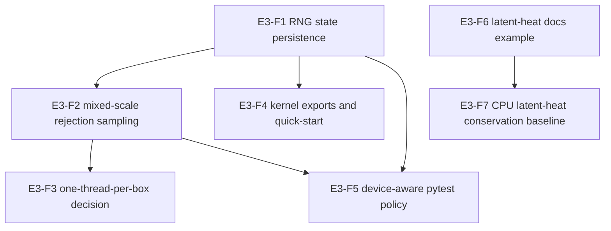

# Dependency Map

## Feature Dependency Graph

## Dependency Details

- **E3-F1 before E3-F2/E3-F4/E3-F5:** RNG semantics affect stochastic sampling
  tests, quick-start examples, and device-aware tolerance policy.
- **E3-F2 before E3-F3:** Sampling characterization informs whether the
  one-thread-per-box design record can be accepted as-is or needs a scoped
  follow-up.
- **E3-F4 before E3-F5 closeout:** The public quick-start import path and
  troubleshooting language should settle before E3-F5 finalizes shared
  CUDA-optional validation and release-check guidance, even though marker/helper
  groundwork can start earlier.
- **E3-F2 before E3-F5:** Mixed-scale stochastic behavior must shape policy for
  statistical tolerances and CUDA-if-available expectations.
- **E3-F6 before E3-F7:** The runnable latent-heat docs example provides a
  concrete scenario for the integration-level CPU conservation baseline.

## External Dependencies

- Existing Warp optional import behavior and `warp_devices()` CUDA detection.
- Existing GPU conversion and environment helpers that enforce explicit device
  ownership.
- Existing CPU `CondensationLatentHeat` and mass-transfer energy diagnostics.

## Blocking Risks

- If Warp API behavior differs between CPU and CUDA for RNG state mutation,
  E3-F1 may need device-specific assertions or documented limitations.
- If mixed-scale sampling cannot be hardened without changing model semantics,
  E3-F2 should publish limitations and open a follow-up feature rather than
  expanding Epic C scope.
