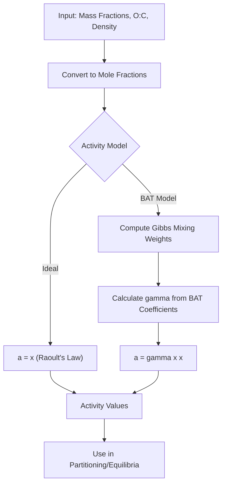

# Activity Theory

Thermodynamic activity is a fundamental concept for understanding how chemical species behave in mixtures. In aerosol science, activity determines the effective concentration of a species, accounting for molecular interactions that cause deviations from ideal behavior. This page covers the theoretical basis for activity calculations in particula.

## Introduction

When organic compounds mix with water in atmospheric aerosols, they rarely behave ideally. The interactions between water molecules and organic molecules create non-ideal behavior that affects:

- **Vapor pressure**: How readily compounds evaporate from particles
- **Water uptake**: How much water aerosols absorb at a given relative humidity
- **Phase behavior**: Whether the mixture remains homogeneous or separates into phases

Understanding and predicting these behaviors requires accurate activity models, which particula provides through the Binary Activity Thermodynamics (BAT) framework.

## Ideal Activity (Raoult's Law)

In an ideal solution, the activity of each component equals its mole fraction. This relationship is known as **Raoult's Law**:

$$a_i = x_i$$

where:

- $a_i$ is the thermodynamic activity of component $i$
- $x_i$ is the mole fraction of component $i$

Raoult's Law assumes that all molecular interactions (solute-solute, solvent-solvent, and solute-solvent) are equivalent. This holds true only for:

- Dilute solutions
- Mixtures of very similar molecules (e.g., isotopes)
- Ideal gases

For organic-water mixtures in aerosols, Raoult's Law is rarely valid because organic molecules and water have very different properties.

## Activity Coefficients

Real mixtures deviate from ideal behavior, and we quantify this deviation using the **activity coefficient** $\gamma_i$:

$$a_i = \gamma_i \cdot x_i$$

The activity coefficient captures all non-ideal effects:

- **$\gamma_i = 1$**: Ideal behavior (Raoult's Law)
- **$\gamma_i > 1$**: Positive deviation (repulsive interactions, higher volatility)
- **$\gamma_i < 1$**: Negative deviation (attractive interactions, lower volatility)

For organic-water mixtures, activity coefficients can vary significantly with composition and temperature, making accurate models essential for aerosol thermodynamics.

## Binary Activity Thermodynamics (BAT) Model

The **Binary Activity Thermodynamics (BAT)** model provides a computationally efficient approach to estimate activity coefficients for organic-water mixtures. Developed by Gorkowski et al. (2019), the BAT model uses fits derived from the comprehensive AIOMFAC thermodynamic model.

### Key Features

The BAT model:

1. **Reduces complexity**: Instead of computing detailed molecular interactions, BAT uses empirical fits based on the oxygen-to-carbon (O:C) ratio
2. **Covers realistic ranges**: Valid for O:C ratios from 0 to 2, covering most atmospheric organics
3. **Captures phase separation**: Predicts when mixtures separate into distinct liquid phases

### Model Inputs

The BAT model requires:

| Parameter | Description | Typical Range |
|-----------|-------------|---------------|
| `molar_mass_ratio` | Ratio of water to organic molecular weight | 0.05 - 0.5 |
| `organic_mole_fraction` | Mole fraction of organic in mixture | 0 - 1 |
| `oxygen2carbon` | Oxygen-to-carbon ratio of organic | 0 - 2 |
| `density` | Mixture density | 1000 - 2000 kg/m^3 |

### Mathematical Formulation

The BAT model computes activity coefficients from the excess Gibbs free energy of mixing. The activity coefficients are derived as:

$$\ln \gamma_w = g^E - x_{org} \cdot \frac{\partial g^E}{\partial x_{org}}$$

$$\ln \gamma_{org} = g^E + (1 - x_{org}) \cdot \frac{\partial g^E}{\partial x_{org}}$$

where:

- $g^E$ is the dimensionless excess Gibbs energy of mixing
- $x_{org}$ is the organic mole fraction
- $\gamma_w$ and $\gamma_{org}$ are the activity coefficients for water and organic

The activities are then:

$$a_w = \gamma_w \cdot (1 - x_{org})$$

$$a_{org} = \gamma_{org} \cdot x_{org}$$

### Fit Coefficients

The BAT model uses three sets of fit coefficients depending on the O:C ratio:

| O:C Range | Fit Set | Description |
|-----------|---------|-------------|
| Low (< 0.3) | `G19_FIT_LOW` | Hydrophobic organics |
| Mid (0.3 - 0.6) | `G19_FIT_MID` | Moderately oxygenated |
| High (> 0.6) | `G19_FIT_HIGH` | Highly oxygenated organics |

These coefficients are interpolated smoothly to provide continuous predictions across the full O:C range.

## Activity Calculation Flow

The following diagram shows how particula calculates activities using the BAT model:



## Gibbs Free Energy and Thermodynamics

The activity coefficient is fundamentally connected to the **Gibbs free energy of mixing** ($\Delta G_{mix}$), which describes the thermodynamic driving force for mixing:

$$\Delta G_{mix} = RT \sum_i x_i \ln(a_i)$$

For an ideal mixture:

$$\Delta G_{mix}^{ideal} = RT \sum_i x_i \ln(x_i)$$

The **excess Gibbs energy** captures non-ideal contributions:

$$G^E = \Delta G_{mix} - \Delta G_{mix}^{ideal} = RT \sum_i x_i \ln(\gamma_i)$$

The BAT model parameterizes $G^E$ using empirical fits, allowing efficient computation of activity coefficients without solving complex molecular interaction equations.

## Functional Group Corrections

Some organic compounds with specific functional groups (alcohols, carboxylic acids, ethers) behave differently than predicted by O:C ratio alone. The BAT model can optionally apply **OH-equivalent corrections** to account for these effects:

```python
from particula.activity import bat_activity_coefficients

# With functional group correction
a_w, a_org, m_w, m_org, g_w, g_org = bat_activity_coefficients(
    molar_mass_ratio=0.09,
    organic_mole_fraction=0.3,
    oxygen2carbon=0.4,
    density=1400.0,
    functional_group="alcohol",  # Optional correction
)
```

This converts the functional group information to an OH-equivalent form before computing activities.

## Implementation in Particula

The BAT activity calculations are implemented in the `particula.activity` module:

| Function | Purpose |
|----------|---------|
| `bat_activity_coefficients()` | Main entry point for BAT calculations |
| `gibbs_mix_weight()` | Computes Gibbs mixing weights |
| `coefficients_c()` | Applies BAT fit coefficients |

### Example Usage

```python
from particula.activity import bat_activity_coefficients

# Calculate activities for a water-organic mixture
activity_water, activity_organic, mass_water, mass_organic, gamma_water, gamma_organic = (
    bat_activity_coefficients(
        molar_mass_ratio=0.09,  # M_water / M_organic
        organic_mole_fraction=0.3,
        oxygen2carbon=0.4,
        density=1400.0,
    )
)

print(f"Water activity: {activity_water:.3f}")
print(f"Organic activity: {activity_organic:.3f}")
print(f"Water activity coefficient: {gamma_water:.3f}")
print(f"Organic activity coefficient: {gamma_organic:.3f}")
```

## References

Gorkowski, K., Preston, T. C., & Zuend, A. (2019). Relative-humidity-dependent organic aerosol thermodynamics via an efficient reduced-complexity model. *Atmospheric Chemistry and Physics*, 19(19), 13383-13407. [https://doi.org/10.5194/acp-19-13383-2019](https://doi.org/10.5194/acp-19-13383-2019)

---

**Next**: [Equilibria Theory](equilibria_theory.md) - Learn how activities are used in gas-particle partitioning calculations.
