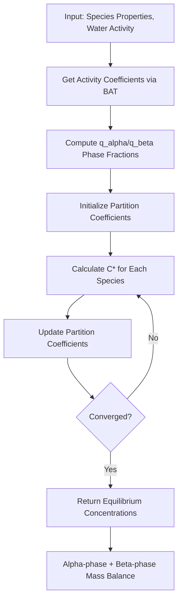

# Equilibria Theory

Gas-particle partitioning determines how semi-volatile organic compounds distribute between the gas phase and particulate matter. This equilibrium process is central to understanding aerosol formation, growth, and composition. This page covers the theoretical basis for equilibria calculations in particula.

## Introduction

When organic vapors encounter aerosol particles, they can condense onto the particle phase. The extent of this partitioning depends on:

- **Saturation vapor pressure**: How volatile the compound is
- **Activity in the particle phase**: Non-ideal mixing effects
- **Available condensed mass**: More organic mass means more partitioning

Understanding these equilibria is essential for predicting secondary organic aerosol (SOA) formation and properties.

## Liquid-Vapor Partitioning Fundamentals

At thermodynamic equilibrium, the partial pressure of each species in the gas phase equals its equilibrium vapor pressure above the liquid (particle) phase:

$$p_i = a_i \cdot p_i^{\circ}$$

where:

- $p_i$ is the partial pressure of species $i$ in the gas phase
- $a_i$ is the activity of species $i$ in the condensed phase
- $p_i^{\circ}$ is the pure component saturation vapor pressure

This relationship links gas-phase concentrations to particle-phase composition through the activity, which accounts for non-ideal mixing.

## Saturation Concentration (C*)

The **saturation concentration** ($C^*$) is a convenient measure of volatility that directly relates to partitioning behavior. It represents the equilibrium vapor concentration when the condensed phase is present.

### Dry vs. Wet C*

The **dry saturation concentration** ($C^*_{dry}$) assumes an ideal, single-component system:

$$C^*_{dry} = \frac{p^{\circ} \cdot M}{R \cdot T}$$

where $M$ is the molecular weight, $R$ is the gas constant, and $T$ is temperature.

In a real mixture with water and multiple organics, the **effective C*** depends on activity coefficients and phase composition:

$$C^*_j = C^*_{j,\mathrm{dry}} \cdot \gamma_{j,\mathrm{phase}} \cdot q_{\mathrm{phase}} \cdot \frac{C_{\mathrm{liq}}}{M_j \cdot \overline{M}_{\mathrm{phase}}}$$

where:

- $\gamma_{j,\mathrm{phase}}$ is the activity coefficient in the target phase
- $q_{\mathrm{phase}}$ is the fraction of mass in that phase
- $C_{\mathrm{liq}}$ is the total liquid concentration
- $\overline{M}_{\mathrm{phase}}$ is the mass-weighted mean molar mass

### Volatility Basis Set

The **Volatility Basis Set (VBS)** framework bins organic compounds by their $C^*$ values, typically using logarithmic bins (e.g., 0.01, 0.1, 1, 10, 100 $\mu$g/m$^3$). This simplifies the treatment of complex organic mixtures by grouping compounds with similar volatility.

| $C^*$ Range ($\mu$g/m$^3$) | Classification |
|---------------------------|----------------|
| < 0.01 | Extremely Low Volatility (ELVOC) |
| 0.01 - 1 | Low Volatility (LVOC) |
| 1 - 100 | Semi-Volatile (SVOC) |
| 100 - 10000 | Intermediate Volatility (IVOC) |
| > 10000 | Volatile (VOC) |

## Partition Coefficient

The **partition coefficient** ($\varepsilon_j$) describes the fraction of species $j$ in the condensed phase at equilibrium:

$$\varepsilon_j = \frac{1}{1 + C^*_j / C_{\mathrm{liq}}}$$

Key behaviors:

- When $C^* \ll C_{liq}$: $\varepsilon \approx 1$ (mostly condensed)
- When $C^* \gg C_{liq}$: $\varepsilon \approx 0$ (mostly gas phase)
- When $C^* = C_{liq}$: $\varepsilon = 0.5$ (equally distributed)

This relationship shows that partitioning depends on both the compound's volatility and the total available condensed mass.

## Phase Separation (LLPS)

Under certain conditions, organic-water mixtures can undergo **Liquid-Liquid Phase Separation (LLPS)**, forming distinct alpha ($\alpha$) and beta ($\beta$) phases:

- **Alpha phase**: Typically organic-rich, with lower water content
- **Beta phase**: Typically water-rich, with higher water content

### When Does Phase Separation Occur?

Phase separation occurs when the Gibbs free energy of a two-phase system is lower than a single homogeneous phase. This typically happens at:

- Intermediate relative humidity (40-80%)
- Higher O:C ratios (more oxygenated organics)
- Specific organic-water composition ranges

### Phase Fraction (q)

The **phase fraction** $q_{\alpha}$ describes the distribution between phases:

$$q_{\alpha} + q_{\beta} = 1$$

Particula uses a smooth sigmoid function to model the transition between single-phase and two-phase regimes, preventing numerical discontinuities during equilibrium solving.

## Equilibrium Solving Process

Particula solves for equilibrium using an iterative optimization approach:



### Objective Function

The equilibrium solver minimizes the difference between guessed and calculated partition coefficients:

$$\text{Error} = \sum_j (\varepsilon_j^{guess} - \varepsilon_j^{calc})^2 + (C_{liq}^{guess} - C_{liq}^{calc})^2$$

Convergence is achieved when this error falls below a threshold (typically $10^{-16}$).

### Mass Balance

At equilibrium, mass must be conserved:

$$C_j^{total} = C_j^{gas} + C_j^{\alpha} + C_j^{\beta}$$

where the particle-phase concentrations include both organic mass and associated water.

## Implementation in Particula

The equilibria calculations are implemented in the `particula.equilibria` module:

| Function | Purpose |
|----------|---------|
| `liquid_vapor_partitioning()` | Main equilibrium solver |
| `liquid_vapor_obj_function()` | Objective function for optimization |
| `get_properties_for_liquid_vapor_partitioning()` | Compute activity/phase inputs |
| `_calculate_cstar()` | Phase-specific C* calculation |

### Example Usage

```python
import numpy as np
from particula.equilibria.partitioning import (
    liquid_vapor_partitioning,
    get_properties_for_liquid_vapor_partitioning,
)

# Define species properties
c_star_dry = np.array([1e-1, 1e0, 1e1])  # ug/m3
c_organic = np.array([1.0, 2.0, 3.0])  # ug/m3
molar_mass = np.array([200.0, 180.0, 220.0])  # g/mol
oxygen2carbon = np.array([0.4, 0.5, 0.6])
density = np.array([1400.0, 1300.0, 1500.0])  # kg/m3

# Get activity properties at 70% RH
gamma_ab, mf_water_ab, q_ab = get_properties_for_liquid_vapor_partitioning(
    water_activity_desired=0.7,
    molar_mass=molar_mass,
    oxygen2carbon=oxygen2carbon,
    density=density,
)

# Solve equilibrium
alpha, beta, system, result = liquid_vapor_partitioning(
    c_star_j_dry=c_star_dry,
    concentration_organic_matter=c_organic,
    molar_mass=molar_mass,
    gamma_organic_ab=gamma_ab,
    mass_fraction_water_ab=mf_water_ab,
    q_ab=q_ab,
)

print(f"Total liquid concentration: {system[0]:.3f} ug/m3")
print(f"Partition coefficients: {system[2]}")
```

## Key Equations Summary

| Equation | Description |
|----------|-------------|
| $p_i = a_i \cdot p_i^{\circ}$ | Vapor-liquid equilibrium |
| $a_i = \gamma_i \cdot x_i$ | Activity from coefficient and mole fraction |
| $\varepsilon_j = \frac{1}{1 + C^*_j / C_{liq}}$ | Partition coefficient |
| $C^*_j = C^*_{j,dry} \cdot \gamma_j \cdot q \cdot \frac{C_{liq}}{M_j \cdot \overline{M}}$ | Effective saturation concentration |

## References

Gorkowski, K., Preston, T. C., & Zuend, A. (2019). Relative-humidity-dependent organic aerosol thermodynamics via an efficient reduced-complexity model. *Atmospheric Chemistry and Physics*, 19(19), 13383-13407. [https://doi.org/10.5194/acp-19-13383-2019](https://doi.org/10.5194/acp-19-13383-2019)

---

**Previous**: [Activity Theory](activity_theory.md) - Learn about the BAT model for activity coefficients.
