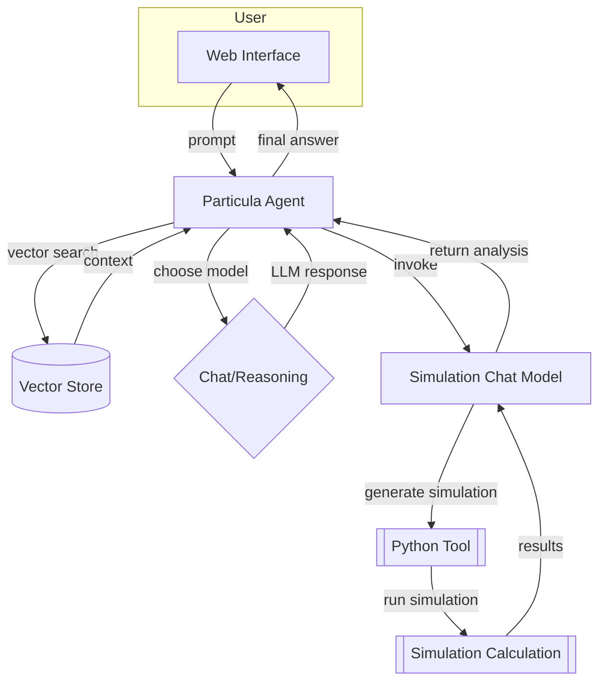

# Agents

The Agent’s role is to decide *which* model to invoke. It can be more independent
than a simple chat or reasoning model, and can orchestrate multiple models
and tools in a single workflow.

## Orchestration flow

This is our current vision for the Agent workflow. It is not yet
implemented, but it will be the basis for the final design.

Decision policy:

- quick explanations, short multimodal queries → Chat (GPT‑4o‑mini)  
- medium complexity with images or ≤128 k context → Chat (GPT‑4o / GPT‑4.1mini)  
- long context, code generation, or tool execution → Reasoning (o3mini / o4‑mini)  
- deeply nested logic or heavy planning → Reasoning (o3 or larger o‑series)

>_Note:_ This Agent workflow is our goal.
