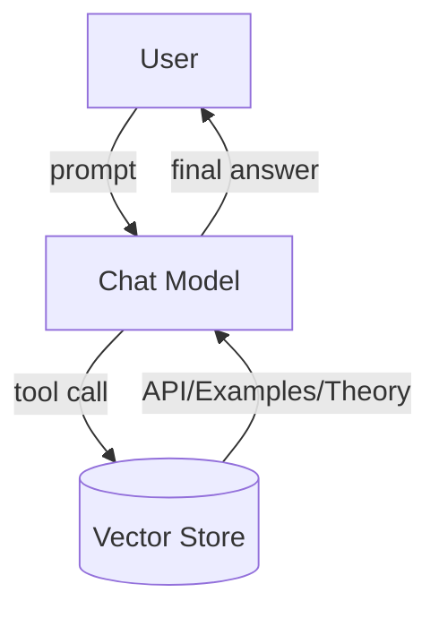

# Chat

Chat models are **conversational generalists**.  
In Particula they are used for:

- interactive tutorials & “explain‑this‑output” prompts,
- quick JSON / YAML scaffolding,
- translating user intent to structured simulation parameters.

Each chat request is wrapped in a **vector‑RAG layer** that pulls
the most relevant Particula API & docs snippets before the prompt
reaches the LLM.

## GPT‑4o

GPT‑4o (o for **omni**) is a multimodal model that natively handles text,
images, and (soon) audio & video inside **one** architecture.

- 128 k‑token context
- GPT‑4‑Turbo parity on code & English 
- better vision & non‑English.

**Use for:** integrated visual or mixed‑media reasoning (diagrams, photos, future A/V).

## GPT‑4o‑mini

Cost- and latency-optimized variant of 4o.

- same 128 k window 
- up to 16 k output tokens 
- improved tokenizer for non‑English.

**Use for:** budget‑sensitive multimodal chat, doc‑grounded image Q&A.

## GPT‑4.1

April 2025 upgrade to 4o.

- 1 M‑token context window
- +21 % coding accuracy vs 4o 
- 26 % cheaper ops.

**Use for:** very‑long‑context refactors, legal/scientific deep‑dives, multi‑step agents.

## GPT‑4.1mini & GPT‑4.1nano

- **mini** – ½ latency, 83 % cheaper than 4o, still beats it on many tasks.  
- **nano** – smallest & fastest of 4.1.

**Use for:** mini → balanced power/cost; nano → ultra‑light, real‑time or mobile agents.

---

