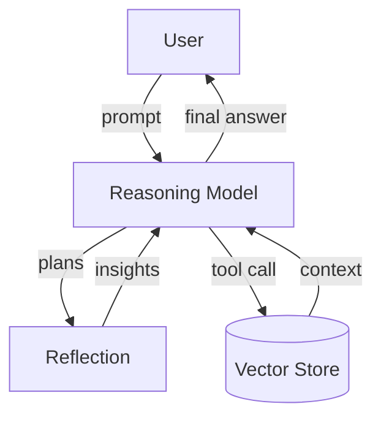

# Reasoning

Reasoning models take over when a problem needs planning,
tool‑execution or long chains of logic that go beyond ordinary chat.
They can internally reflect (“think‑step‑by‑step”), decide which tool
to call, run it, and stitch the results into a final answer.

Like the chat models, every reasoning call is loaded with the
same vector‑store **RAG retrieval**: the user query is embedded, the
k‑nearest Particula code/doc chunks are fetched, and those snippets
are injected as system context before step‑by‑step
reasoning begins.

For Particula, the reasoning models are good at creating new
simulations that integrate multiple examples. They are also good at
explaining complex parts of the code, and can help with debugging.

## o1

Released Dec 2024.

Reflective model that “thinks before it speaks”, excelling at logic‑heavy
tasks and often outscoring GPT‑4o on scientific proofs or algorithm design.  

**Use for:** pure‑text, deep step‑by‑step reasoning when no images are needed.

## o3

April 2025 flagship reasoning model.

Combines multimodal thinking with full ChatGPT tool access
(web, Python exec, file/vision analysis, memory).

**Use for:** demanding multimodal + tool workflows (data‑science with charts,
iterative coding with live runs, image‑grounded research).

## o3-mini

Compact version of o3. Same multimodal & tool features, lower latency/cost.  

**Use for:** throughput‑ or budget‑constrained environments needing o3 power.

## o4‑mini  

Released alongside o3, optimized for speed & efficiency.  

99.5 % AIME‑2025 pass rate with Python interpreter, very low latency.  

**Use for:** high‑volume or real‑time multimodal apps (edu tools, live autograding).

---

Reference:

- [OpenAI Docs](https://platform.openai.com/docs/models)
- [OpenAI o3 o4-mini press release](https://openai.com/index/introducing-o3-and-o4-mini/)