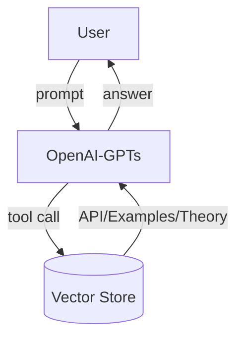
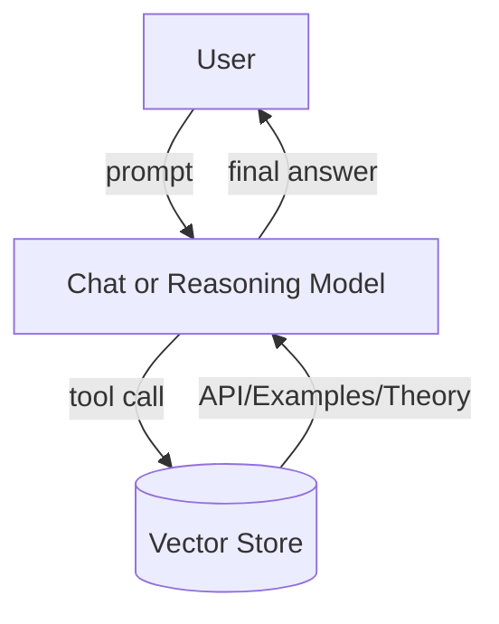

# OpenAI Models

High‑quality API docstrings, runnable examples, and deep theory notes are not mere decoration in Particula—they are the very “fuel” of the OpenAI models and retrieval‑augmented‑generation (RAG) pipeline. Every one of those text chunks is embedded and stored in the shared vector database; when a user asks a question the RAG step pulls them back and feeds them to the model.  The clearer and more complete those chunks are, the more precise and executable the answers and Python simulation code the model can generate.  Improving documentation therefore directly improves the context and domain intelligence of the models.

Particula uses OpenAI models in **three functional layers**.  

Every request—no matter which model you pick—goes through the same
retrieval‑augmented‑generation (**RAG**) pipeline:

1. Embed the user prompt and generate additional related search terms. 
2. Pull the *k* nearest code / doc chunks from the shared vector store.  
3. Prepend those chunks to the prompt before generating the final answer.

This RAG step is therefore **universal** across all layers.

| Layer | RAG‑assisted purpose | Main Models |
|-------|----------------------|-------------|
| [1. Chat](Models/Chat.md) | Conversational & multimodal I/O (vector‑RAG enriched) | gpt‑4o, gpt‑4o‑mini, gpt‑4.1, gpt‑4.1‑mini/‑nano |
| [2. Reasoning](Models/Reasoning.md) | Tool‑calling, step‑by‑step logic (vector‑RAG enriched) | o1, o3, o3‑mini, o4‑mini |
| [3. Agent](Models/Agents.md) | Orchestrates Chat ＋ Reasoning with RAG. | ParticulaAgent |

The following pages drill into each layer.

- **[1. Chat](Models/Chat.md)** – conversational generalists, vector‑RAG enriched.
- **[2. Reasoning](Models/Reasoning.md)** – tool‑calling, step‑by‑step logic, vector‑RAG enriched.
- **[3. Agent](Models/Agents.md)** – Self‑orchestrating agent that combines Chat ✚ Reasoning with RAG. *Note: this is a work in progress.*

_Tip:_ Start with **Chat** for “How do I…?” questions, move to
**Reasoning** for multi‑step workflows.

### Particula Assistant – OpenAI GPTs (public access)

Anyone can use the public
[Particula Assistant](https://chatgpt.com/g/g-67b9dffbaa988191a4c7adfd4f96af65-particula-assistant).
It runs the base GPT chat models and is perfect for quick Q&A or simple
code snippets—no special approval required.

### Particula Chat Beta – advanced models (via access request)

Access to the advanced GPT‑4.1 and o‑series models
(both Chat **and** Reasoning) requires a one‑time access request.
See the link in the GitHub [Discussions](https://github.com/uncscode/particula/discussions) to apply, then login with GitHub at [Particula Chat Beta](https://particula-rag.fly.dev/closed_beta).

## Other model families & future support

Particula will eventually add adapters for Anthropic Claude, Google Gemini,
and leading open‑source models (Llama 3, Mixtral, etc.).  For now the docs
focus on OpenAI because we want to **scale deep before we scale wide**:

1. One provider → one API surface → fewer moving parts while we harden
   the RAG/tool stack.
2. Deep optimization of prompt templates, token accounting, error handling
   and retries is possible only when the target is fixed.
3. A single deterministic reference model keeps examples, tests and
   benchmarks reproducible for every contributor.

Once this vertical integration is rock‑solid, adding new providers is a
matter of writing a thin adapter under the existing chat-interface facade—the
Agent, RAG retrieval, and prompt logic remain unchanged.

This “depth‑first, breadth‑later” strategy yields robust tools sooner,
benefiting new users with stability and advanced users with a clear path to
multi‑vendor redundancy.

---

Reference: [OpenAI Docs](https://platform.openai.com/docs/models)