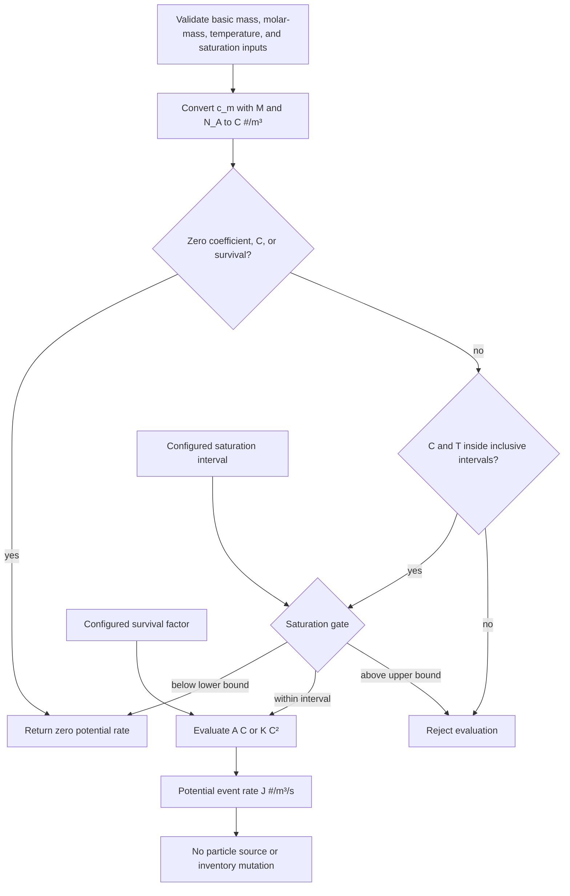
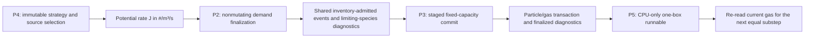

# Nucleation Discussion

Nucleation, or new particle formation (NPF), is the gas-to-particle conversion process that creates new aerosol particles directly from vapor molecules. Unlike condensation, which grows existing particles, nucleation generates new particles by assembling molecular clusters that become thermodynamically stable once they exceed a critical size. Nucleation controls aerosol number concentrations in many environments, seeds the growth that produces cloud condensation nuclei, and is the starting point of the NPF-to-cloud-droplet size range.

This follows Chapter 11 of Seinfeld, J. H., & Pandis, S. N. (2016). Atmospheric Chemistry and Physics: From Air Pollution to Climate Change (3rd ed.). Wiley.

## Homogeneous Nucleation (Classical Nucleation Theory)

Classical nucleation theory (CNT) describes single-species (homomolecular) homogeneous nucleation: clusters of a vapor form spontaneously in a supersaturated gas without pre-existing surfaces. The competition is between the free-energy cost of creating new surface and the free-energy gain of moving molecules from a supersaturated vapor into the condensed phase.

### Saturation Ratio

**Equation 1: Saturation Ratio**

S = pᵢ / pᵢ^sat

**Where:**

- **S**: Saturation ratio (dimensionless).
- **pᵢ**: Partial pressure of the nucleating species **i** in the gas phase.
- **pᵢ^sat**: Saturation vapor pressure of pure species **i** over a flat surface.

**Description:**

Nucleation requires supersaturation (**S > 1**). The larger the saturation ratio, the smaller the critical cluster and the faster the nucleation rate. For **S ≤ 1**, cluster formation is always uphill in free energy and no nucleation occurs.

### Gibbs Free Energy of Cluster Formation

**Equation 2: Free Energy of an r-Sized Cluster**

ΔG(r) = 4 × π × r² × σ − (4 × π × r³ / (3 × v₁)) × k_B × T × ln S

**Where:**

- **ΔG(r)**: Gibbs free energy change to form a spherical cluster of radius **r**.
- **r**: Cluster radius.
- **σ**: Surface tension of the cluster (bulk-liquid value in CNT).
- **v₁**: Volume of one molecule in the condensed phase (**v₁ = molar massᵢ / (ρ × N_A)**).
- **k_B**: Boltzmann constant.
- **T**: Temperature.
- **ρ**: Density of the condensed phase.
- **N_A**: Avogadro's number.

**Description:**

The first term is the surface-energy penalty, which grows as **r²**. The second term is the volume free-energy gain from transferring molecules out of the supersaturated vapor, which grows as **r³**. For **S > 1** the sum passes through a maximum at the critical radius: clusters smaller than the critical size tend to evaporate, and clusters larger than it tend to grow.

### Critical Radius

**Equation 3: Critical Cluster Radius (Kelvin Relation)**

r* = (2 × σ × v₁) / (k_B × T × ln S)

**Where:**

- **r***: Critical cluster radius.

**Description:**

The critical radius is where **dΔG/dr = 0**. It is the same Kelvin relation that governs the equilibrium vapor pressure over curved surfaces in condensation (see the [condensation equations](Condensation_Equations.md#kelvin-effect-correction-factor)). A cluster of radius **r*** is in unstable equilibrium with the vapor: any fluctuation pushes it toward growth or evaporation.

### Nucleation Barrier

**Equation 4: Free-Energy Barrier**

ΔG* = (16 × π × σ³ × v₁²) / [3 × (k_B × T × ln S)²] = (4/3) × π × σ × (r*)²

**Where:**

- **ΔG***: Free-energy barrier at the critical radius.

**Description:**

The barrier height controls the nucleation rate exponentially. Because **ΔG*** scales as **σ³ / (ln S)²**, nucleation rates are extraordinarily sensitive to both surface tension and saturation ratio: small changes in either can shift the rate by many orders of magnitude. This sensitivity is the main practical difficulty in applying CNT quantitatively.

### Nucleation Rate

**Equation 5: Classical Homogeneous Nucleation Rate**

J = z × β* × N₁ × exp( −ΔG* / (k_B × T) )

**Where:**

- **J**: Nucleation rate (new stable clusters per unit volume per unit time).
- **z**: Zeldovich non-equilibrium factor (typically ~0.01-1), accounting for the fact that some clusters at the barrier top still evaporate.
- **β***: Rate at which vapor molecules collide with the critical cluster (condensation flux onto the critical cluster).
- **N₁**: Number concentration of vapor monomers.

**Description:**

The prefactor **z × β* × N₁** is kinetic: how often clusters at the critical size are hit by another monomer, weighted by the population of monomers available. The exponential is thermodynamic: the probability of fluctuating over the barrier. A commonly used closed form for a single species (Seinfeld & Pandis, 2016, Eq. 11.47) is:

J = ( (2 × σ) / (π × m₁) )^(1/2) × v₁ × N₁² × exp( −ΔG* / (k_B × T) )

where **m₁** is the molecular mass of the nucleating species.

## Binary and Multicomponent Nucleation

Atmospheric nucleation is rarely a single-species process. The most studied system is binary sulfuric acid-water nucleation, where the critical cluster contains both species and the free-energy surface is two-dimensional (a saddle point rather than a simple maximum).

**Equation 6: Binary Cluster Free Energy (Conceptual Form)**

ΔG(n₁, n₂) = n₁ × (μ₁,liquid − μ₁,gas) + n₂ × (μ₂,liquid − μ₂,gas) + 4 × π × r² × σ(x)

**Where:**

- **n₁, n₂**: Number of molecules of species 1 and 2 in the cluster.
- **μᵢ,liquid − μᵢ,gas**: Chemical potential difference for species **i** between the cluster liquid and the gas phase.
- **σ(x)**: Composition-dependent surface tension at cluster mole fraction **x**.

**Description:**

The critical cluster sits at the saddle point of **ΔG(n₁, n₂)**, and the nucleation rate follows the lowest free-energy path through that saddle. In practice, binary H₂SO₄-H₂O nucleation rates are evaluated with fitted parameterizations (for example Vehkamäki et al., 2002) rather than by direct evaluation of CNT, because CNT's bulk-property assumptions fail for clusters of a few molecules. Ternary systems (adding ammonia or amines) and ion-induced nucleation further lower the effective barrier and are handled by dedicated parameterizations or cluster-dynamics models.

## Empirical Nucleation Parameterizations

Because CNT is quantitatively unreliable for atmospheric systems, boundary-layer NPF is often represented with empirical rate laws fitted to observations. Two standard forms relate the nucleation rate to the sulfuric acid vapor concentration:

**Equation 7: Activation-Type Nucleation**

J = A × [H₂SO₄]

**Equation 8: Kinetic-Type Nucleation**

J = K × [H₂SO₄]²

**Where:**

- **C** (or **[H₂SO₄]**): precursor gas number concentration [#/m³].
- **A**: Activation coefficient [s⁻¹], fitted for a site and set of
  conditions.
- **K**: Kinetic coefficient [m³/s], fitted for a site and set of conditions.
- **J**: Potential formation-event rate [#/m³/s].

**Description:**

The activation form assumes existing thermodynamically stable clusters are activated by a single sulfuric acid molecule; the kinetic form assumes the rate-limiting step is a collision between two sulfuric-acid-containing molecules or clusters. The activation interpretation follows the cluster-activation context of Kulmala, Lehtinen, and Laaksonen (2006); both forms are empirical parameterizations, rather than replacements for CNT or a general multicomponent mechanism. Their coefficients must use units consistent with the chosen concentration units: a value reported in cm³/s must be converted before use with C in #/m³. The broader nucleation framework and CNT limitations follow Seinfeld and Pandis (2016).

### Scalar Potential-Rate Boundary

The bounded rate evaluator computes only **potential event rates**. It is used
by the immutable P4 construction boundary; it is not itself a particle-source
transaction. It first converts precursor mass concentration to number
concentration:

**Equation 9: Precursor Number Concentration**

$$
C = \frac{c_m}{M} N_A
$$

where $c_m$ is precursor mass concentration [kg/m³], $M$ is precursor molar
mass [kg/mol], and $N_A$ is Avogadro's constant [#/mol]. Thus $C$ has units
[#/m³]. The resulting configured rate equations, including a dimensionless
survival factor $f_{\mathrm{surv}}$, are

$$
J_{\mathrm{activation}} = f_{\mathrm{surv}} A C
\qquad\text{and}\qquad
J_{\mathrm{kinetic}} = f_{\mathrm{surv}} K C^2.
$$

The unit check is intentional: $A C$ and $K C^2$ both yield [#/m³/s]. If a
published kinetic coefficient is expressed in cm³/s, convert it before use
with concentration in #/m³:

$$
K_{\mathrm{m^3/s}} = 10^{-6} K_{\mathrm{cm^3/s}}.
$$

The survival factor is supplied configuration, not a quantity inferred from
the state. It is dimensionless and represents a caller's modelling choice
about the relation between the formation size and another size of interest.

Basic input validation, including saturation presence and form, and mass-to-
number conversion occur before every zero return. A valid zero coefficient,
concentration, or survival factor then returns exactly zero before closed-domain
membership is checked. Validity intervals are closed: their lower and upper
endpoints are accepted for nonzero calculations. Saturation is optional; when
it is configured, saturation below its lower bound is a deliberate zero-rate
gate, while saturation above its upper bound is rejected. This asymmetric
behavior prevents an unsupported high-saturation extrapolation from being
silently treated as a valid rate.

Formation-size metadata and injection composition may accompany the rate
configuration so that a later source process can state its intended physical
representation. They do not alter either equation. In particular, rate
evaluation neither creates particles nor gas/particle inventories, chooses
slots, depletes precursor vapor, or applies a timestep. P4 is the bounded,
CPU-only public construction API for immutable activation and kinetic
strategies, their builders, factory, and source-selection configuration through
`particula.dynamics.nucleation` and `particula.dynamics`; it is not a runnable
or GPU capability.

## Survival to Detectable and Model-Resolved Sizes

Freshly nucleated clusters must grow through the smallest sizes, where coagulational scavenging by pre-existing particles is fastest, before they matter for the resolved aerosol population. The apparent formation rate at a larger diameter **d** is related to the "true" nucleation rate at diameter **d*** by a survival probability.

**Equation 10: Kerminen-Kulmala Survival Relation**

J_d = J_d* × exp( γ × (1/d − 1/d*) × CS' / GR )

**Where:**

- **J_d**: Apparent particle formation rate at diameter **d**.
- **J_d***: Nucleation rate at the initial cluster diameter **d***.
- **γ**: Proportionality constant expressed in units compatible with the
  selected diameter, condensation-sink, and growth-rate units. For SI
  substitution, use meters for **d** and **d*** and choose **γ** so that
  `γ × CS' / GR` has units of meters; do not mix the original fitted-unit
  coefficient with SI inputs without converting it.
- **CS'**: Condensation sink of the pre-existing particle population
  (scavenging strength), in the units used by the selected **γ**.
- **GR**: Growth rate of the freshly formed particles, in units compatible with
  **γ** and **CS'**.

**Description:**

The exponential expresses the competition between growth (**GR**, escape to safety at larger sizes) and coagulational loss to the existing aerosol surface (**CS'**). High pre-existing surface area suppresses observable NPF even when the nucleation rate itself is large. In a simulation, this relation is a consistency check: if the model injects particles at a size larger than the true cluster size, the injection rate should be the survival-corrected **J_d**, not the raw **J_d***. P4 does not evaluate this relation; its survival factor is an externally selected value whose scientific justification remains the caller's responsibility.

For supported execution, see the [CPU nucleation example](../../../Examples/Nucleation/cpu_nucleation.py)
and [CPU Nucleation Strategy System](../../../Features/nucleation_strategy_system.md).
The hand-built [custom single-species notebook](../../../Examples/Nucleation/Notebooks/Custom_Nucleation_Single_Species.ipynb)
is illustrative only and is not the supported API.

## Nucleation as a Source Term in Aerosol Dynamics

In an aerosol dynamics model, nucleation enters the population balance as a source of new particles at the smallest resolved size:

**Equation 11: Number Source Term**

dN/dt |_nucleation = J

**Equation 12: Coupled Gas Depletion**

dCᵢ/dt |_nucleation = − J × n*ᵢ × (molar massᵢ / N_A)

**Where:**

- **dN/dt |_nucleation**: Rate of new particle number production per unit volume.
- **dCᵢ/dt |_nucleation**: Rate of change of gas-phase mass concentration of species **i** due to nucleation.
- **n*ᵢ**: Number of molecules of species **i** in a freshly formed particle at the injection size.

**Description:**

Each nucleation event moves a small but nonzero mass of each participating vapor into the particle phase, so number production and gas depletion must be applied together to conserve mass. Numerical treatment differs by representation:

- **Binned/sectional:** add **J × Δt** particles (and the corresponding mass) to the smallest bin each timestep.
- **Particle-resolved with fixed-capacity slots:** activate inactive particle slots with the injection-size mass and composition. Because nucleation rates can be large, one computational particle typically represents many real particles via its concentration/weighting factor; the number of slots activated per step and the weight assigned to each is a resolution decision. When inactive slots run out, a resampling or volume-scaling policy is required.
- **Stiffness coupling:** freshly nucleated particles sit at the fast-equilibration end of the condensation stiffness range, so the nucleation source interacts directly with the time-integration scheme chosen for condensation.

### Fixed-capacity primitive boundary

Particula ships bounded CPU slot-exhaustion primitives for planning,
resampling, and representative-volume scaling, plus direct Warp primitives for
fixed-shape resampling and representative-volume scaling. Their ownership,
planning, and mutation boundaries are documented in the
[Fixed-Capacity Slot Exhaustion Primitives](../../../Features/slot_exhaustion_policies.md).

These are slot-management primitives, not a nucleation process: they do not
construct a particle source or deplete gas. The supported process boundary is
the CPU-only, single-box `particula.dynamics.Nucleation` runnable, configured
with `NucleationCommitConfig`. It adapts the legacy `Aerosol` backing
containers and mutates the backing particle and partitioning-gas data by
identity; it does not provide GPU execution.

**Implementation boundary:**

- The CPU-only P4 activation and kinetic potential-rate strategies, builders,
  source-selection metadata, and factory are supported public construction APIs.
  They remain immutable configuration and rate-evaluation boundaries only.
- The concrete CPU P2 particle-source planner and P3 finalization transaction
   remain in `particula.dynamics.nucleation.particle_source`. They are not
   re-exported through `particula.dynamics.nucleation` or `particula.dynamics`.
   P2 returns inventory-limited source demand and diagnostics without mutation;
   P3 owns the bounded particle/gas transaction.
- `Nucleation` applies equal sequential substeps and re-reads the current gas
  state before each rate calculation, so completed substeps can change later
  rates. Atomicity is per attempted P3 substep only: a completed earlier
  substep is not rolled back if a later substep fails. P2/P3 helpers remain
   concrete-only, and GPU support remains deferred.

### Shipped CPU source transaction

The layers deliberately separate rate selection from irreversible state
updates:

For each P5 substep, the current potential rate is multiplied by the equal
substep duration to obtain a potential event count [#/m³]. Concrete-only P2
uses the per-event species mass

$$
m_{\mathrm{event},i}=n_i\frac{M_i}{N_A}\quad[\mathrm{kg/event}]
$$

and admits one shared count across participating species, limited by the
tightest gas inventory, before any mutation. Concrete-only P3 stages slot
activation, resampling, and representative-volume scaling on private particle
state, then transfers each represented event's species mass from partitioning
gas to particle mass in one commit. Its bookkeeping uses concentration-weighted
particle inventory,

$$
I_{p,i}=\sum_j c_j m_{j,i}\quad[\mathrm{kg/m^3}],
$$

so every box/species ledger is checked as particle plus gas with
`rtol=1e-12` and `atol=1e-30`.

Diagnostics distinguish potential, admitted, gas-limited, represented, and
reduced events, identify limiting species, and report requested/activated/
released slots and selected exhaustion policy and scale. Resampling is the
first exhausted-capacity policy; representative-volume scaling is its fallback.
For scaled rows the reference total is `scale * pre_total`; the supported
unscaled example uses `requested_scale == minimum_scale == 1.0` and directly
asserts total-mass conservation. P2 is nonmutating, P3 preflight rejection is
atomic, and P5 rollback scope is one attempted substep rather than a complete
call.

P5 is the supported public `Nucleation` runnable. It is CPU-only and accepts
exactly one legacy `Aerosol` box, retaining its backing particle and
partitioning-gas containers by identity. It performs equal sequential
substeps, recomputing the rate from the gas left by each successful commit. A
successful earlier substep therefore remains visible if a later P2/P3 attempt
fails; P5 deliberately offers no whole-call rollback.

### Direct-Warp P1--P5 correspondence

The bounded direct-Warp step is distinct from the CPU runnable. It computes
`C = c N_A / M` [#/m³], activation `J = S * A * C` with `A` [s⁻¹], or kinetic
`J = S * K * C²` with `K` [m³/s]. Its potential demand is
`E_pot = J * dt` [#/m³]. P2 admits one shared inventory-limited event demand
before the P5 particle/gas transfer. In these rate laws, `S` is the configured,
dimensionless survival factor (not the saturation ratio); `c` is [kg/m³] and
`M` is [kg/mol].

Direct P1 accepts finite nonnegative duration, coefficient, and survival;
inclusive configured precursor bounds; positive temperature; optional configured
saturation bounds; positive formation diameter [m]; and nonnegative integer
molecule counts with at least one positive entry. Temperature is either a
positive scalar or same-device `wp.float64` `(B,)`; configured saturation is
same-device `wp.float64` `(B, S)` or comes from a validated environment.

The bounded public ordering is P1 read-only domain/schema preflight, read-only
validation of the public P4 controls and buffers, P2 inventory admission, P3
fixed-slot staging, participating-molecule eligibility validation, P4
resampling-first/scaling-fallback resolution, and P5 handoff validation followed
by the fused commit when final counts are nonzero. An empty box dimension returns
after the public P4 validation. A configured zero-work or no-admission result
still has its applicable planning, staging, and P4 diagnostic phases, but P5
observes zero final counts and launches no particle/gas writer; it is a
successful no-op, not an error.

Invalid rejection during the read-only public checks preserves particles and gas.
P2--P4 may have changed documented sidecars before a later rejection, and
rollback is not promised after an entered exhaustion primitive or a P5 launch.

For an unscaled P5 row, concentration-weighted particle plus gas inventory is
conserved per box/species at `rtol=1e-12, atol=1e-30`. A scaled row compares
against `s * initial_particle + initial_gas`; P5 source transfer still balances
the gas removal. This is direct-kernel conservation evidence, not CPU parity.

The direct step excludes hidden transfer/synchronization, CPU fallback,
resize/compaction, GPU Runnable/scheduling/backend selection, E6-F9
orchestration, expanded physics, graph capture, autodiff, and performance
guarantees. See the [direct example](../../../Examples/Nucleation/gpu_direct_nucleation.py)
and [feature contract](../../../Features/nucleation_strategy_system.md).

## Variable Descriptions

**Understanding the Parameters:**

1. **Saturation Ratio (S):**

   - The single most important control on homogeneous nucleation; rates change by orders of magnitude over small changes in **S**.
   - Set by the gas-phase concentration and the temperature-dependent saturation vapor pressure, so accurate vapor pressures are prerequisites for any nucleation calculation.

2. **Surface Tension (σ):**

   - Enters the barrier as **σ³**; the dominant uncertainty in CNT.
   - Bulk surface tension is a poor approximation for clusters of a few molecules (the main criticism of CNT); composition dependence matters for multicomponent clusters.

3. **Molecular Volume (v₁):**

   - Condensed-phase volume per molecule; links the molar mass and liquid density of the nucleating species.

4. **Critical Radius (r*):**

   - Typically ~0.5-2 nm for atmospheric conditions; clusters at this size contain only tens to hundreds of molecules.
   - The same Kelvin physics that penalizes condensation onto the smallest particles.

5. **Zeldovich Factor (z):**

   - Corrects the equilibrium cluster distribution for the fact that the barrier crossing is a diffusive process in cluster-size space.

6. **Condensation Sink (CS'):**

   - Integral measure of how quickly vapors and small clusters are scavenged by the pre-existing particle population.
   - Couples nucleation to the rest of the aerosol: more pre-existing surface means less survival of fresh clusters.

7. **Growth Rate (GR):**

   - Diameter growth rate of freshly formed particles, set by condensation of available vapors.
   - Together with **CS'**, controls what fraction of nucleated clusters survive to climate- and health-relevant sizes.

8. **Formation-Size Molecule Count (n*ᵢ):**

   - Composition of the particle injected into the model at the formation size; needed for mass conservation between the gas and particle phases.

**Applications and Implications:**

- **Aerosol Number Budgets:** Nucleation is the dominant source of particle number in many clean and moderately polluted environments, feeding the accumulation mode through subsequent growth.

- **Cloud Condensation Nuclei:** A substantial fraction of CCN originate as nucleated particles that grew by condensation and coagulation, so NPF connects gas-phase chemistry to cloud microphysics.

- **Chamber and Flow-Tube Experiments:** Prescribed-precursor experiments (the multi-box and parcel use cases) often begin with a nucleation burst; simulating them requires a particle source, not just growth of an initial population.

**Assumptions and Limitations:**

- **Capillarity Approximation:** CNT treats molecular clusters as spherical droplets with bulk liquid density and surface tension. For critical clusters of tens of molecules this is a strong assumption and the main source of CNT's quantitative error.

- **Steady-State Cluster Distribution:** The classical rate assumes the sub-critical cluster population is in steady state with the vapor; rapid changes in vapor concentration or temperature violate this.

- **Parameterization Validity Ranges:** Empirical forms (Equations 7-8) and fitted parameterizations (for example Vehkamäki et al., 2002) are only valid within the temperature, humidity, and concentration ranges of the underlying data; extrapolation can produce unphysical rates.

- **Bounded Scalar Evaluation:** The P4 rate strategies accept scalar precursor
  state only and enforce configured, inclusive concentration and temperature
  intervals. Optional saturation below the lower interval is treated as no
  event; saturation above its upper interval is not extrapolated. A zero
  potential rate is not evidence that nucleation is physically absent outside
  a parameterization's domain.

- **Bounded conservation step:** Without representative-volume scaling, the
  shipped P5 source transaction conserves supported partitioning-gas and
  particle inventory directly. For a row selected for representative-volume
  scaling, accounting instead compares the post-step inventory to the selected
  scale times its pre-step inventory, with the finalized source-mass transfer
  included in that transaction reference. This CPU-only, single-box,
  fixed-capacity work is not a general multiphysics source.

- **Injection-Size Convention:** Models inject particles at a chosen formation size, not at the true critical size. The nucleation rate must be survival-corrected (Equation 10) to be consistent with that choice.

**Further Considerations:**

- **Ion-Induced and Heterogeneous Pathways:** Ions and pre-existing surfaces lower the nucleation barrier; these pathways need separate rate expressions.

- **Cluster Dynamics Models:** Explicit cluster-population models (for example ACDC-type birth-death schemes) replace the CNT barrier picture with molecule-by-molecule kinetics and are the current standard for sulfuric acid-base systems.

- **Differentiability:** Nucleation rate expressions are smooth functions of gas concentrations and temperature, but the act of activating discrete particle slots is a discrete event. For gradient-based optimization, a binned or expected-value (mean-field) source term is differentiable, while discrete slot activation requires the same surrogate treatment as stochastic coagulation.

---

## Conclusion

Nucleation converts supersaturated vapor into new particles through a
barrier-crossing process whose rate is exponentially sensitive to saturation
ratio and surface tension. The bounded P4/P5 CPU implementation is narrower:
it evaluates configured empirical potential rates and commits a one-box,
fixed-capacity, gas-conserving source transaction. Its configured survival
factor provides no independently calculated growth or scavenging physics.
Vehkamäki et al. (2002) is scientific context only, not implemented physics.

---

## References

1. **Seinfeld, J. H., & Pandis, S. N. (2016).** *Atmospheric Chemistry and Physics: From Air Pollution to Climate Change* (3rd ed.), Chapter 11: Nucleation. Wiley.

2. **Vehkamäki, H., Kulmala, M., Napari, I., Lehtinen, K. E. J., Timmreck, C., Noppel, M., & Laaksonen, A. (2002).** An improved parameterization for sulfuric acid-water nucleation rates for tropospheric and stratospheric conditions. *Journal of Geophysical Research: Atmospheres*, 107(D22), 4622. DOI: [10.1029/2002JD002184](https://doi.org/10.1029/2002JD002184)

3. **Kerminen, V.-M., & Kulmala, M. (2002).** Analytical formulae connecting the "real" and the "apparent" nucleation rate and the nuclei number concentration for atmospheric nucleation events. *Journal of Aerosol Science*, 33(4), 609-622. DOI: [10.1016/S0021-8502(01)00194-X](https://doi.org/10.1016/S0021-8502(01)00194-X)

4. **Kulmala, M., Lehtinen, K. E. J., & Laaksonen, A. (2006).** Cluster activation theory as an explanation of the linear dependence between formation rate of 3 nm particles and sulphuric acid concentration. *Atmospheric Chemistry and Physics*, 6, 787-793. DOI: [10.5194/acp-6-787-2006](https://doi.org/10.5194/acp-6-787-2006)

5. **Zhang, R., Khalizov, A., Wang, L., Hu, M., & Xu, W. (2012).** Nucleation and growth of nanoparticles in the atmosphere. *Chemical Reviews*, 112(3), 1957-2011. DOI: [10.1021/cr2001756](https://doi.org/10.1021/cr2001756)
