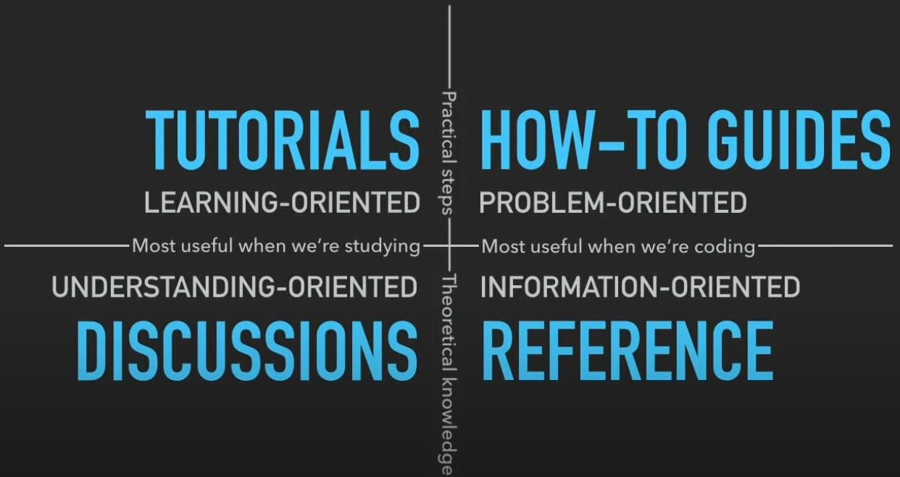

# Beta Features :material-flask-plus:

For beta features, find them at the [Particula-Beta](https://uncscode.github.io/particula-beta/)

## Particle Resolved

- [x] Coagulation needs to be implemented
- [x] check equilibrium for condensation and evaporation

## Continuous Particle PDF and PMF

- [ ] Bin Remapping after condensation and evaporation is needed, or dr/dt method
- [x] Coagulation needs to be checked for PMF vs PDF handling
- [x] ODE solver for both needs to be implemented

## Scavenging

- [ ] Scavenging needs to be implemented for Particle Resolved

## Activity Coefficients

- [ ] BAT model needs added to activity coefficient calculation

# Guides for Developers

- [x] More focused reorganization of the code and examples.

