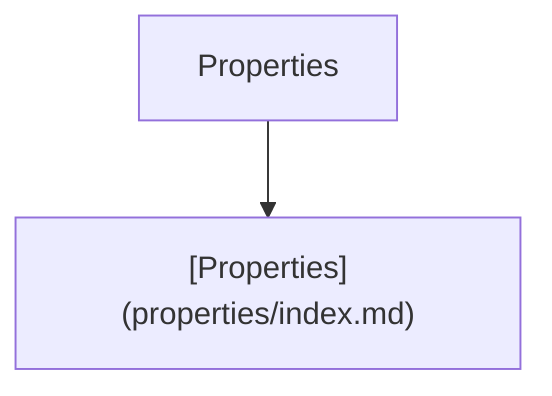
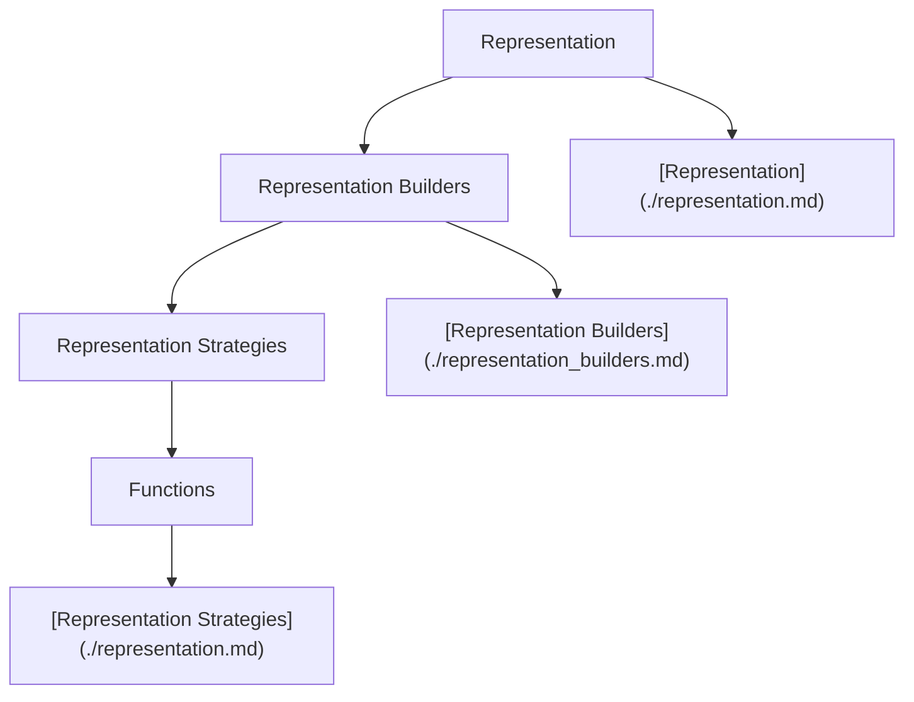
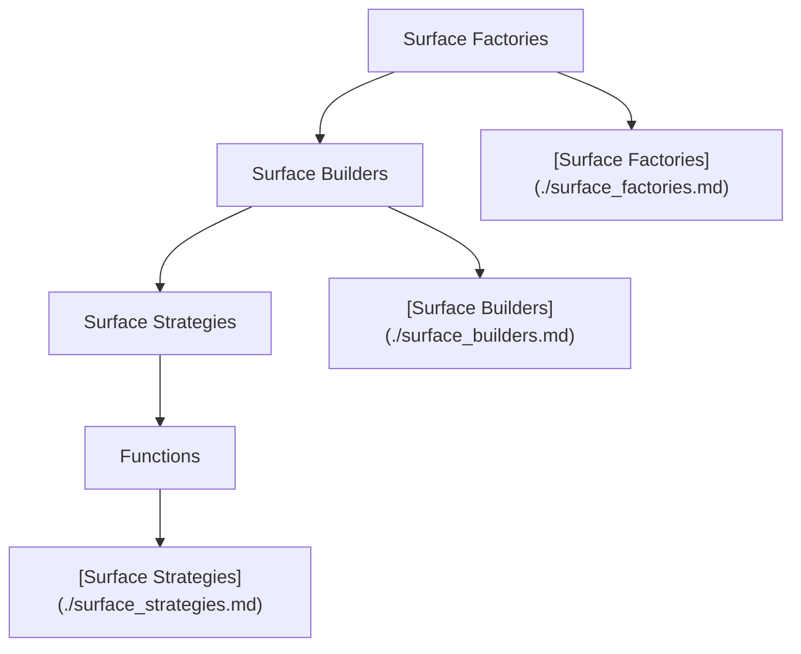

# Next Outline

Next is the next iteration of the particula simulation model. It is a complete rewrite of the model, with a focus on improving the modularity and extensibility of the model. The goal is to make it easier to add new features and to make the model more flexible and easier to use.

## Tutorials

- [Aerosol Distribution](Tutorials/Aerosol_Distributions.ipynb)
- [Vapor Pressure](Tutorials/Vapor_Pressure.ipynb)
- [Gas Species](Tutorials/Gas_Species.ipynb)

## Guides for Developers

## Diagrams

To make your documentation clearer and more digestible, you can split the Mermaid diagram into multiple parts, each focusing on a specific component of your aerosol code structure. Below, each diagram is followed by a placeholder for your text descriptions:

### Activity Component

*Description of Activity Component here...*

### Distribution Component

*Description of Distribution Component here...*

### Properties Component

*Description of Properties Component here...*

### Representation Component

*Description of Representation Component here...*

### Surface Component

*Description of Surface Component here...*

This approach not only visually segments the different components of your code but also provides spaces between diagrams for detailed descriptions, making it easier for readers to understand each part's functionality and role within the larger system.