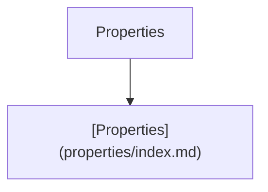
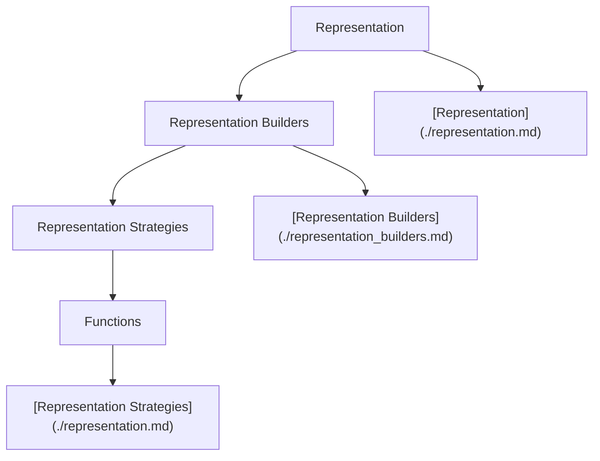
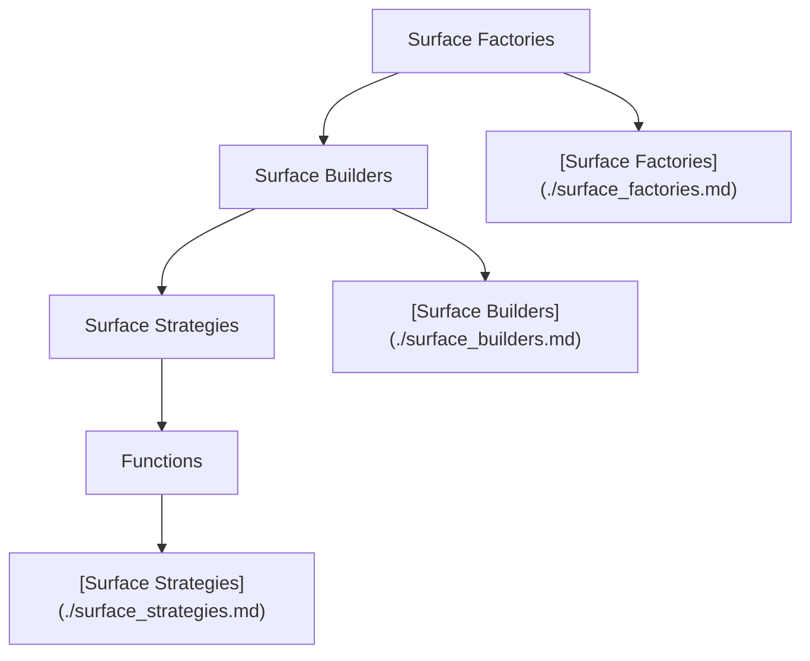

# Next Outline

Next is the next iteration of the particula simulation model. It is a complete rewrite of the model, with a focus on improving the modularity and extensibility of the model. The goal is to make it easier to add new features and to make the model more flexible and easier to use.

## Tutorials

### Gas Phase

- [Vapor Pressure Tutorial](Tutorials/Vapor_Pressure.ipynb)
- [Gas Species Tutorial](Tutorials/Gas_Species.ipynb)
- [Atmosphere Tutorial](Tutorials/AtmosphereTutorial.ipynb)

### Particle Phase

- [Aerosol Surface Tutorial](Tutorials/Particle_Surface_Tutorial.ipynb)
- [Aerosol Distribution Tutorial](Tutorials/Aerosol_Distributions.ipynb)

## Guides for Developers

## Diagrams

### Activity Component

*Description of Activity Component here...*

### Distribution Component

*Description of Distribution Component here...*

### Properties Component

*Description of Properties Component here...*

### Representation Component

*Description of Representation Component here...*

### Surface Component

*Description of Surface Component here...*
