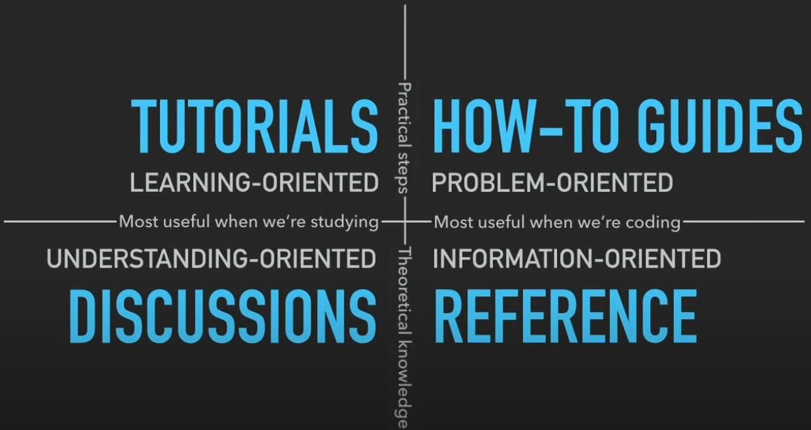

# Next Outline

Next is the next iteration of the particula simulation model. It is a complete rewrite of the model, with a focus on improving the modularity and extensibility of the model. The goal is to make it easier to add new features and to make the model more flexible and easier to use.

## Tutorials

### Gas Phase

- [Vapor Pressure Tutorial](Tutorials/Gas_Phase/Vapor_Pressure.ipynb)
- [Gas Species Tutorial](Tutorials/Gas_Phase/Gas_Species.ipynb)
- [Atmosphere Tutorial](Tutorials/Gas_Phase/AtmosphereTutorial.ipynb)

### Particle Phase

- [Aerosol Surface Tutorial](Tutorials/Particle_Phase/Particle_Surface_Tutorial.ipynb)
- [Activity Tutorial](Tutorials/Particle_Phase/Activity_Tutorial.ipynb)
- [Distribution Tutorial](Tutorials/Particle_Phase/Distribution_Tutorial.ipynb)
- [Types of Distributions Tutorial](Tutorials/Particle_Phase/Aerosol_Distributions.ipynb)
- [Particle Representation Tutorial](Tutorials/Particle_Phase/Particle_Representation_Tutorial.ipynb)

### Aerosol

- [Aerosol Tutorial](Tutorials/Aerosol/Aerosol_Tutorial.ipynb)

### Dynamics

#### Condensation

- [Condensation Tutorial: Moving Bin](Tutorials/Dynamics/Condensation/Condensation_Tutorial-1.ipynb)
- [Condensation Tutorial: Particle Resolved](Tutorials/Dynamics/Condensation/Condensation_Tutorial-2.ipynb)

#### Coagulation
- [Coagulation Tutorial: Basic 1-PMF](Tutorials/Dynamics/Coagulation/Coagulation_Basic_1_PMF.ipynb)
- [Coagulation Tutorial: Basic 2-PDF](Tutorials/Dynamics/Coagulation/Coagulation_Basic_2_PDF.ipynb)
- [Coagulation Tutorial: Basic 3-Compared](Tutorials/Dynamics/Coagulation/Coagulation_Basic_3_compared.ipynb)
- [Coagulation Tutorial: Basic 4-Particle Resolved](Tutorials/Dynamics/Coagulation/Coagulation_Basic_4_ParticleResolved.ipynb)
- [Coagulation Tutorial: Basic 5-Super Droplet Method](Tutorials/Dynamics/Coagulation/Coagulation_Basic_5_SDM.ipynb)

## Discussions

- [Condensation Discussion](Discussions/Condensation_Discussion.md)

## Data Analysis

- [Fitting Lognormal PDF: 2 Modes](Tutorials/Data/Fitting_lognormal_PDFs_2modes.ipynb)

## Guides for Developers

## Prioritization

- [Features](Discussions/Features.md)