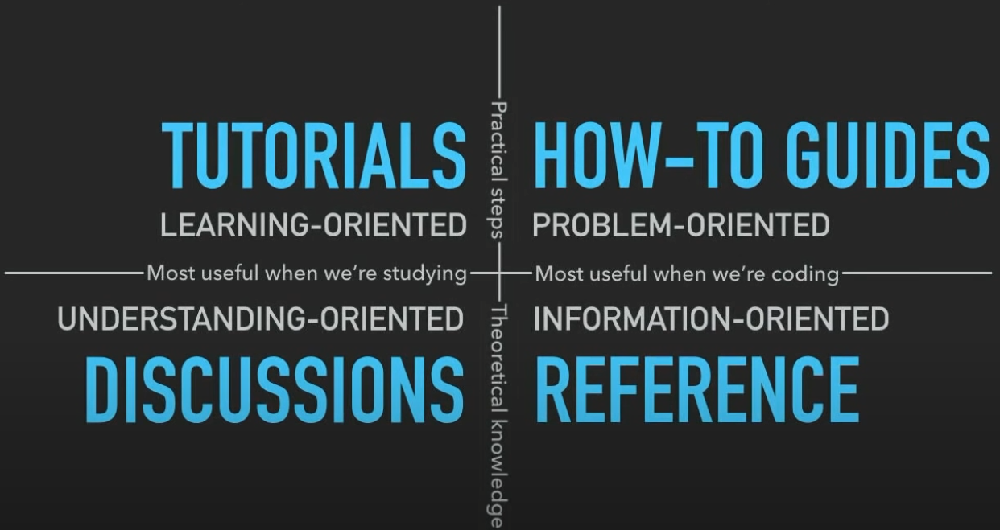

# Next Outline

Next is the next iteration of the particula simulation model. It is a complete rewrite of the model, with a focus on improving the modularity and extensibility of the model. The goal is to make it easier to add new features and to make the model more flexible and easier to use.

## Particle Resolved

- [x] Coagulation needs to be implemented
- [x] check equilibrium for condensation and evaporation

## Continuous Particle PDF and PMF

- [ ] Bin Remapping after condensation and evaporation is needed, or dr/dt method
- [x] Coagulation needs to be checked for PMF vs PDF handling
- [x] ODE solver for both needs to be implemented

## Scavenging

- [ ] Scavenging needs to be implemented for Particle Resolved

## Activity Coefficients

- [ ] BAT model needs added to activity coefficient calculation

# Guides for Developers

- [x] More focused reorganization of the code and examples.

