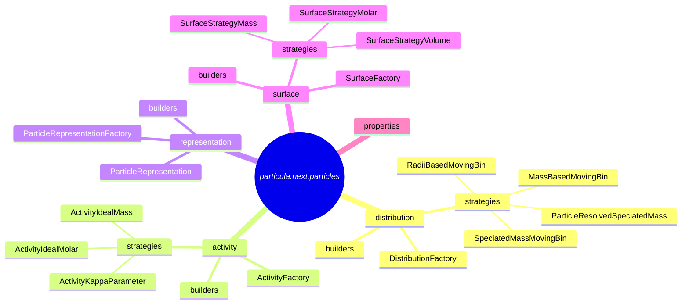

---
# Condensation_Equations.md

# Condensation Discussion

Isothermal and non-isothermal condensation processes are fundamental in aerosol dynamics. Condensation involves the transfer of gas-phase species to the particle phase, which can be reversible when the species evaporates back into the gas phase. This process is pivotal in the formation of cloud droplets and the growth of atmospheric particles, influencing climate and air quality.

## Condensation Isothermal

In the isothermal case, we consider condensation processes where the temperature remains constant, and the latent heat of vaporization is neglected. This approximation is valid when the heat released or absorbed during condensation or evaporation is insufficient to cause significant temperature changes.

This follows Chapter 2 (EQ 2.41) by Topping, D., & Bane, M. (2022). Introduction to Aerosol Modelling (D. Topping & M. Bane, Eds.). Wiley. https://doi.org/10.1002/9781119625728. Also Chapter 12 and 13 (EQ 13.3) of Seinfeld, J. H., & Pandis, S. N. (2016). Atmospheric Chemistry and Physics: From Air Pollution to Climate Change (3rd ed.). Wiley.

The isothermal condensation or evaporation process is defined by the following equation:

**Equation 1: Rate of Mass Change**

dmi/dt = N × k_cond × (pᵢ, gas − pᵢ, particle surface) × (molar massᵢ / (R × T))

**Where:**

- **dmi/dt**: Rate of change of mass of species **i** in the particle phase.
- **N**: Number of particles.
- **k_cond**: Per-particle first-order condensation coefficient.
- **pᵢ, gas**: Partial pressure of species **i** in the gas phase.
- **pᵢ, particle surface**: Partial pressure of species **i** at the particle surface, accounting for curvature and activity effects.
- **molar massᵢ**: Molar mass of species **i**.
- **R**: Ideal gas constant.
- **T**: Temperature.

**Description:**

This equation quantifies the net mass flux of species **i** from the gas phase to the particle phase (or vice versa) due to condensation or evaporation. The driving force is the difference in partial pressures (**pᵢ, gas − pᵢ, particle surface**), and it's scaled by the molar mass and thermodynamic constants to yield a mass rate.

## Condensation with Latent Heat

When condensation results in significant heat release or absorption, the latent heat of vaporization must be considered. This scenario is critical in cloud droplet formation, where the heat effects can influence the condensation rate and local temperature.

Derivation from Topping, D., & Bane, M. (2022) equation 2.36.

**Equation 5: Rate of Mass Change with Latent Heat**

dm/dt = [N × 4 × π × radius_wet × Dᵢ × (pᵢ, gas − pᵢ, particle surface)] / { [ (Dᵢ × Lᵢ × pᵢ) / (κ × T) ] × [ (Lᵢ / (R × T)) − 1 ] + Rᵢ × T }

**Where:**

- **dm/dt**: Rate of change of mass of the droplet.
- **m**: Mass of the droplet.
- **radius_wet**: Wet radius of the droplet.
- **Dᵢ**: Diffusion coefficient of species **i**.
- **pᵢ, gas**: Partial pressure of species **i** in the gas phase.
- **pᵢ, particle surface**: Partial pressure at the particle surface.
- **Lᵢ**: Latent heat of vaporization for species **i**.
- **κ**: Thermal conductivity of air.
- **T**: Temperature.
- **Rᵢ**: Specific gas constant for species **i** (**R / molar massᵢ**).

**Description:**

This equation modifies the isothermal rate to include thermal effects due to latent heat. The denominator accounts for the additional resistance to mass transfer caused by the temperature gradient established from heat release or absorption during phase change.


## Additional Parameters


### First-Order Condensation Coefficient

**Equation 2: Condensation Coefficient**

k_cond = 4 × π × radius_particle × Dᵢ × f(Kn, αᵢ)

**Where:**

- **radius_particle**: Radius of the particle.
- **Dᵢ**: Diffusion coefficient of species **i** in the gas phase.
- **f(Kn, αᵢ)**: Correction factor accounting for the transition between free-molecular and continuum regimes.
  - **Kn**: Knudsen number.
  - **αᵢ**: Mass accommodation coefficient.

**Description:**

The condensation coefficient **k_cond** represents the flux of molecules to the particle surface per unit concentration difference. It combines geometric factors with diffusion dynamics and corrections for different flow regimes.

### Correction Factor **f(Kn, αᵢ)**

**Equation 3: Correction Factor**

f = [0.75 × αᵢ × (1 + Kn)] / [Kn² + Kn + 0.283 × αᵢ × Kn + 0.75 × αᵢ]

**Where:**

- **αᵢ**: Mass accommodation coefficient for species **i**.
- **Kn**: Knudsen number.

**Knudsen Number:**

**Equation 4: Knudsen Number**

Kn = λᵢ / radius_particle

**Where:**

- **λᵢ**: Mean free path of gas molecules for species **i**.
- **radius_particle**: Particle radius.

**Description:**

The correction factor **f(Kn, αᵢ)** adjusts the condensation coefficient to account for the finite mean free path of gas molecules relative to the particle size. It ensures accurate depiction of mass transfer in both the free-molecular (high Kn) and continuum (low Kn) regimes.


### Partial Pressures

Understanding the partial pressures in the gas phase and at the particle surface is essential for calculating the condensation rate.

**Gas Phase Partial Pressure:**

**Equation 6: Gas Phase Partial Pressure**

pᵢ, gas = concᵢ, gas × (R × T) / molar massᵢ

**Where:**

- **concᵢ, gas**: Concentration of species **i** in the gas phase.

**Description:**

This equation relates the concentration of a gas-phase species to its partial pressure using the ideal gas law, adjusted for the molar mass of the species.

---

**Particle Surface Partial Pressure:**

**Equation 7: Particle Surface Partial Pressure**

pᵢ, particle surface = pᵢ^pure × γᵢ × xᵢ × kᵢ, Kelvin

**Where:**

- **pᵢ^pure**: Saturation vapor pressure of pure species **i** (also denoted as **pᵢ^sat**, **pᵢ^vap**, or **pᵢ^0**).
- **γᵢ**: Activity coefficient of species **i** in the particle phase.
- **xᵢ**: Mole fraction of species **i** in the particle phase.
- **kᵢ, Kelvin**: Kelvin effect correction factor.

**Description:**

This equation adjusts the pure saturation vapor pressure to account for solution non-idealities (via **γᵢ** and **xᵢ**) and curvature effects (via **kᵢ, Kelvin**).


### Kelvin Effect Correction Factor

**Equation 8: Kelvin Effect**

kᵢ, Kelvin = exp( kᵢ, Kelvin radius / radius_particle )

**Where:**

- **kᵢ, Kelvin radius**: Kelvin radius factor.

**Equation 9: Kelvin Radius Factor**

kᵢ, Kelvin radius = [2 × σ_surface × molar massᵢ] / [ R × T × density ]

**Where:**

- **σ_surface**: Surface tension of the particle.
- **density**: Density of the particle.

**Description:**

The Kelvin effect expresses how vapor pressure over a curved surface differs from that over a flat surface. Small particles exhibit increased vapor pressure due to curvature, influencing condensation and evaporation rates.

## Variable Descriptions

**Understanding the Parameters:**

1. **Mass Accommodation Coefficient (αᵢ):**

   - Represents the probability that a molecule colliding with the particle surface will stick and be incorporated into the particle.
   - Values range from 0 (no sticking) to 1 (all molecules stick upon collision).
   - Influenced by surface properties, temperature, and species-specific interactions.

2. **Diffusion Coefficient (Dᵢ):**

   - Indicates how quickly species **i** diffuses through the gas phase.
   - Dependent on temperature, pressure, and molecular characteristics.
   - Higher **Dᵢ** leads to faster mass transfer to the particle surface.

3. **Mean Free Path (λᵢ):**

   - Average distance a gas molecule travels before colliding with another molecule.
   - Inversely proportional to pressure; decreases as pressure increases.
   - Important for calculating the Knudsen number and determining the appropriate flow regime.

4. **Knudsen Number (Kn):**

   - Dimensionless number that characterizes the flow regime.
     - **Kn << 1**: Continuum regime; diffusion dominates.
     - **Kn >> 1**: Free-molecular regime; ballistic motion dominates.
   - Essential for selecting the correct correction factor **f(Kn, αᵢ)**.

5. **Latent Heat of Vaporization (Lᵢ):**

   - Energy required to convert species **i** from liquid to vapor without temperature change.
   - Affects the heat balance during condensation and influences the condensation rate when significant.

6. **Thermal Conductivity (κ):**

   - Measures the ability of air to conduct heat.
   - Determines how quickly heat generated or absorbed at the particle surface is dissipated.

7. **Activity Coefficient (γᵢ):**

   - Accounts for non-ideal interactions between molecules in the particle phase.
   - Deviations from ideality can significantly impact the equilibrium vapor pressure.

8. **Surface Tension (σ_surface):**

   - Affects the Kelvin effect.
   - Dependent on particle composition and temperature.
   - Influential for small particles where curvature effects are pronounced.

**Applications and Implications:**

- **Aerosol Growth:** These equations are vital for predicting how aerosols grow through condensation, impacting visibility, climate forcing, and human health.
  
- **Cloud Formation:** Understanding condensation with latent heat is essential for cloud microphysics, influencing cloud droplet activation and lifetime.
  
- **Air Quality Modeling:** Accurately modeling gas-particle partitioning helps in predicting pollutant behavior and secondary aerosol formation.

**Assumptions and Limitations:**

- **Isothermal Assumption:** In the isothermal equation, neglecting latent heat is valid only when temperature changes are negligible. For processes involving significant heat exchange, the non-isothermal equation should be used.
  
- **Spherical Particles:** The equations assume particles are spherical, which may not hold true for all aerosols (e.g., fractal soot particles).
  
- **Uniform Composition:** Assumes homogeneous particle composition. In reality, phase separation or gradients may exist within particles.

**Further Considerations:**

- **Multicomponent Systems:** In mixtures, interactions between different species can complicate calculations. Mutual diffusion coefficients and interactive effects need to be considered.
  
- **Dynamic Conditions:** Environmental factors like fluctuating temperature and pressure can affect condensation rates. Real-world applications may require time-dependent modeling.
  
- **Parameter Estimation:** Accurate values for parameters like **Dᵢ**, **αᵢ**, and **γᵢ** are necessary for precise predictions but can be challenging to obtain, especially for complex organic species.

---

## Conclusion

By reviewing the equations and expanding on the descriptions, we enhance the understanding of condensation processes in aerosol dynamics. The interplay between mass transfer, thermodynamics, and kinetics is critical for accurately modeling aerosol behavior. Recognizing the importance of each parameter and the assumptions inherent in these equations allows for more informed application and interpretation in research and environmental modeling.

---

## References

1. **Topping, D., & Bane, M. (2022).** *Introduction to Aerosol Modelling*. Wiley. DOI: [10.1002/9781119625728](https://doi.org/10.1002/9781119625728)

2. **Seinfeld, J. H., & Pandis, S. N. (2016).** *Atmospheric Chemistry and Physics: From Air Pollution to Climate Change* (3rd ed.). Wiley.


---
# DNS_Fluid_and_Particle_Properties_Comparison.md

# Fluid and Particle Properties for Cloud Droplet Coagulation

This notebook verifies the computations performed by the `Particula` library by comparing its results with those presented in the paper by Ayala et al. (2008). The comparisons focus on key parameters that influence cloud droplet coagulation processes, such as Reynolds number, inertia time, settling velocity, Stokes number, and scaled velocities.
**Objective:**
- To validate the accuracy of the `Particula` library in computing fluid and particle properties relevant to cloud droplet coagulation.
**Reference Tables:**
- **Table 2:** Provides values for Reynolds number, inertia time, settling velocity, and correction factors for different particle sizes.
- **Table 3:** Includes characteristic scales for cloud droplets, such as Stokes numbers and scaled velocities at various turbulent dissipation rates.

**Reference Paper:**
Ayala, O., Rosa, B., Wang, L. P., & Grabowski, W. W. (2008). Effects of turbulence on the geometric collision rate of sedimenting droplets. Part 1. Results from direct numerical simulation. *New Journal of Physics*, 10. https://doi.org/10.1088/1367-2630/10/7/075015
By conducting this comparison, we aim to ensure that the `Particula` library produces reliable results that align with established literature, which is crucial for accurate simulations in aerosol science and cloud physics.


```python
import numpy as np
import matplotlib.pyplot as plt

from particula.particles import properties
from particula.gas import properties as gas_properties

from particula.util.constants import STANDARD_GRAVITY
from particula.util.converting.units import convert_units
import pandas as pd
from IPython.display import display
```

## Model Equations and Parameters
In this section, we define the particle radii and other parameters needed for the calculations. These include temperature, particle density, fluid density, and air velocity.


```python
# %%

particle_radius = np.linspace(10e-6, 60e-6, 6)
temperature = 273  # Temperature in Kelvin
particle_density = 1000  # Particle density in kg/m³
fluid_density = 1.0  # Fluid (air) density in kg/m³
air_velocity = 1e-9  # Relative velocity in m/s

turbulent_dissipation = 400 * convert_units(
    "cm^2/s^3", "m^2/s^3"
)  # Example value in m²/s³
reynolds_lambda = 72.41  # Example value
```

### Calculate Dynamic and Kinematic Viscosity
We calculate the dynamic and kinematic viscosity of the fluid using the temperature and fluid density.


```python
# %%

dynamic_viscosity = gas_properties.get_dynamic_viscosity(temperature)
kinematic_viscosity = gas_properties.get_kinematic_viscosity(
    dynamic_viscosity, fluid_density
)
kolmogorov_time = gas_properties.get_kolmogorov_time(
    kinematic_viscosity=kinematic_viscosity,
    turbulent_dissipation=turbulent_dissipation,
)
```


### Calculate Particle Settling Velocity
This section calculates the particle settling velocity using the slip correction factor and other parameters.


```python
# %%

mean_free_path = gas_properties.molecule_mean_free_path(
    temperature=temperature, dynamic_viscosity=dynamic_viscosity
)

# 2. Slip correction factors
knudsen_number = properties.calculate_knudsen_number(
    mean_free_path=mean_free_path, particle_radius=particle_radius
)
slip_correction_factor = properties.cunningham_slip_correction(knudsen_number)
# iterative terminal settling velocity
iterative_settling_velocity = (
    properties.get_particle_settling_velocity_with_drag(
        particle_radius=particle_radius,
        particle_density=particle_density,
        fluid_density=fluid_density,
        dynamic_viscosity=dynamic_viscosity,
        slip_correction_factor=slip_correction_factor,
        gravitational_acceleration=STANDARD_GRAVITY,
    )
)
settling_velocity = properties.particle_settling_velocity(
    particle_radius=particle_radius,
    particle_density=particle_density,
    slip_correction_factor=slip_correction_factor,
    dynamic_viscosity=dynamic_viscosity,
)
relative_velocity = iterative_settling_velocity - air_velocity
```

### Calculate Particle Inertia Time
We calculate the particle inertia time, which is a measure of how quickly a particle responds to changes in the surrounding fluid.


```python
# %%

particle_inertia_time = properties.get_particle_inertia_time(
    particle_radius=particle_radius,
    particle_density=particle_density,
    fluid_density=fluid_density,
    kinematic_viscosity=kinematic_viscosity,
)

re_p = 2 * particle_radius * relative_velocity / kinematic_viscosity
f_re_p = 1 + 0.15 * re_p**0.687

ao2008_re_p = np.array([0.015, 0.116, 0.378, 0.851, 1.566, 2.537])
ao2008_t_p = np.array([0.0013, 0.0052, 0.0118, 0.0209, 0.0327, 0.0471])
ao2008_f_re_p = np.array([1.008, 1.034, 1.077, 1.134, 1.204, 1.284])

# calculate relative velocity from re_p
ao2008_velocity = ao2008_re_p * kinematic_viscosity / (2 * particle_radius)


particle_settling_velocity = (
    properties.get_particle_settling_velocity_via_inertia(
        particle_inertia_time=particle_inertia_time,
        particle_radius=particle_radius,
        relative_velocity=iterative_settling_velocity,
        slip_correction_factor=slip_correction_factor,
        gravitational_acceleration=STANDARD_GRAVITY,
        kinematic_viscosity=kinematic_viscosity,
    )
)
```

### Comparison of Paper Values and Computed Values
We compare the values from the paper with the computed values from the Particula library. This includes the Reynolds number, inertia time, and settling velocity.
#### Analysis
The plots below show the comparison between the values reported in Ayala et al. (2008) and the values computed using the `Particula` library. The percent errors are also calculated to quantify the discrepancies.
- **Reynolds Number (Re_p):** The Reynolds number is a dimensionless quantity representing the ratio of inertial forces to viscous forces acting on the particles. The comparison shows that the computed Reynolds numbers closely match the paper values, with minimal percent errors (typically less than a few percent), indicating accurate modeling of particle-fluid interactions.
- **Inertia Time (t_p):** The inertia time signifies how quickly a particle adjusts its velocity relative to the surrounding fluid. The computed inertia times align well with the paper values, validating the correctness of particle inertia calculations in `Particula`.
- **Settling Velocity:** This is the terminal velocity at which particles settle under gravity in a quiescent fluid. The computed settling velocities are in good agreement with the paper values, demonstrating accurate calculations of gravitational settling influenced by particle size and fluid properties.
Overall, the `Particula` library provides results consistent with established literature, affirming its reliability for simulating particle dynamics in atmospheric studies.


```python
# Plot comparison
fig, ax = plt.subplots(3, 1, figsize=(5, 7))

ax[0].plot(
    particle_radius * 1e6,
    ao2008_re_p,
    "o-",
    color="black",
    alpha=0.6,
    label="ao2008 Re_p",
)
ax[0].plot(
    particle_radius * 1e6, re_p, "x--", color="black", label="Particula Re_p"
)
ax[0].set_title("Reynolds Number Comparison")
ax[0].set_xlabel("Particle Radius (micrometers)")
ax[0].set_ylabel("Reynolds Number (Re_p)")
ax[0].legend()

ax[1].plot(
    particle_radius * 1e6,
    ao2008_t_p,
    "o-",
    color="#E69F00",
    alpha=0.6,
    label="ao2008 t_p",
)
ax[1].plot(
    particle_radius * 1e6,
    particle_inertia_time,
    "x--",
    color="#E69F00",
    label="Particula t_p",
)
ax[1].set_title("Particle Inertia Time Comparison")
ax[1].set_xlabel("Particle Radius (micrometers)")
ax[1].set_ylabel("Inertia Time (seconds)")
ax[1].legend()

ax[2].plot(
    particle_radius * 1e6,
    ao2008_velocity * 100,
    "o-",
    color="#56B4E9",
    alpha=0.6,
    label="ao2008 Velocity",
)
ax[2].plot(
    particle_radius * 1e6,
    particle_settling_velocity * 100,
    "x--",
    color="#56B4E9",
    label="Particula Velocity",
)
ax[2].set_title("Particle Settling Velocity Comparison")
ax[2].set_xlabel("Particle Radius (micrometers)")
ax[2].set_ylabel("Settling Velocity (centimeters per second)")
ax[2].legend()

plt.tight_layout()
plt.show()
```


    

    


Table 2: Values for Reynolds number, inertia time, settling velocity, and correction factors for different particle sizes.

Percents of error are calculated as:
$$\text{Error} = \frac{\text{Computed Value} - \text{Paper Value}}{\text{Paper Value}} \times 100$$


```python
# Calculate percent error
percent_error_re_p = 100 * (re_p - ao2008_re_p) / ao2008_re_p
percent_error_tp = 100 * (particle_inertia_time - ao2008_t_p) / ao2008_t_p
percent_error_velocity = (
    100 * (particle_settling_velocity - ao2008_velocity) / ao2008_velocity
)
percent_error_f_re_p = 100 * (f_re_p - ao2008_f_re_p) / ao2008_f_re_p

# Create DataFrame for Paper Values From Table 2
paper_values_df = pd.DataFrame(
    {
        "Radius (µm)": particle_radius * 1e6,
        "t_p (s)": ao2008_t_p,
        "Settling Velocity (cm/s)": ao2008_velocity * 100,
        "Re_p": ao2008_re_p,
        "f(Re_p)": ao2008_f_re_p,
    }
)
print("Paper Values From Table 2")
display(paper_values_df)

# print settling velocity in a table format
# Create DataFrame for Particula Computed Values
computed_values_df = pd.DataFrame(
    {
        "Radius (µm)": particle_radius * 1e6,
        "t_p (s)": particle_inertia_time,
        "Settling Velocity (cm/s)": particle_settling_velocity * 100,
        "Re_p": re_p,
        "f(Re_p)": f_re_p,
    }
)
print("Particula Computed Values")
display(computed_values_df)

# Create a DataFrame for percent errors
percent_errors_df = pd.DataFrame(
    {
        "Radius (µm)": particle_radius * 1e6,
        "Percent Error in t_p (%)": percent_error_tp,
        "Percent Error in Settling Velocity (%)": percent_error_velocity,
        "Percent Error in Re_p (%)": percent_error_re_p,
        "Percent Error in f(Re_p) (%)": percent_error_f_re_p,
    }
)
print("Percent Errors for Re_p, t_p, and Settling Velocity")
display(percent_errors_df)
```

    Paper Values From Table 2


<div>
<style scoped>
    .dataframe tbody tr th:only-of-type {
        vertical-align: middle;
    }

    .dataframe tbody tr th {
        vertical-align: top;
    }

    .dataframe thead th {
        text-align: right;
    }
</style>
<table border="1" class="dataframe">
  <thead>
    <tr style="text-align: right;">
      <th></th>
      <th>Radius (µm)</th>
      <th>t_p (s)</th>
      <th>Settling Velocity (cm/s)</th>
      <th>Re_p</th>
      <th>f(Re_p)</th>
    </tr>
  </thead>
  <tbody>
    <tr>
      <th>0</th>
      <td>10.0</td>
      <td>0.0013</td>
      <td>1.286443</td>
      <td>0.015</td>
      <td>1.008</td>
    </tr>
    <tr>
      <th>1</th>
      <td>20.0</td>
      <td>0.0052</td>
      <td>4.974247</td>
      <td>0.116</td>
      <td>1.034</td>
    </tr>
    <tr>
      <th>2</th>
      <td>30.0</td>
      <td>0.0118</td>
      <td>10.806122</td>
      <td>0.378</td>
      <td>1.077</td>
    </tr>
    <tr>
      <th>3</th>
      <td>40.0</td>
      <td>0.0209</td>
      <td>18.246052</td>
      <td>0.851</td>
      <td>1.134</td>
    </tr>
    <tr>
      <th>4</th>
      <td>50.0</td>
      <td>0.0327</td>
      <td>26.860932</td>
      <td>1.566</td>
      <td>1.204</td>
    </tr>
    <tr>
      <th>5</th>
      <td>60.0</td>
      <td>0.0471</td>
      <td>36.263402</td>
      <td>2.537</td>
      <td>1.284</td>
    </tr>
  </tbody>
</table>
</div>


    Particula Computed Values


<div>
<style scoped>
    .dataframe tbody tr th:only-of-type {
        vertical-align: middle;
    }

    .dataframe tbody tr th {
        vertical-align: top;
    }

    .dataframe thead th {
        text-align: right;
    }
</style>
<table border="1" class="dataframe">
  <thead>
    <tr style="text-align: right;">
      <th></th>
      <th>Radius (µm)</th>
      <th>t_p (s)</th>
      <th>Settling Velocity (cm/s)</th>
      <th>Re_p</th>
      <th>f(Re_p)</th>
    </tr>
  </thead>
  <tbody>
    <tr>
      <th>0</th>
      <td>10.0</td>
      <td>0.001296</td>
      <td>1.269408</td>
      <td>0.014910</td>
      <td>1.008342</td>
    </tr>
    <tr>
      <th>1</th>
      <td>20.0</td>
      <td>0.005182</td>
      <td>4.929853</td>
      <td>0.118837</td>
      <td>1.034720</td>
    </tr>
    <tr>
      <th>2</th>
      <td>30.0</td>
      <td>0.011660</td>
      <td>10.613863</td>
      <td>0.400579</td>
      <td>1.080009</td>
    </tr>
    <tr>
      <th>3</th>
      <td>40.0</td>
      <td>0.020729</td>
      <td>17.791768</td>
      <td>0.948931</td>
      <td>1.144694</td>
    </tr>
    <tr>
      <th>4</th>
      <td>50.0</td>
      <td>0.032389</td>
      <td>26.470099</td>
      <td>1.539373</td>
      <td>1.201742</td>
    </tr>
    <tr>
      <th>5</th>
      <td>60.0</td>
      <td>0.046640</td>
      <td>35.746130</td>
      <td>2.495206</td>
      <td>1.281128</td>
    </tr>
  </tbody>
</table>
</div>


    Percent Errors for Re_p, t_p, and Settling Velocity


<div>
<style scoped>
    .dataframe tbody tr th:only-of-type {
        vertical-align: middle;
    }

    .dataframe tbody tr th {
        vertical-align: top;
    }

    .dataframe thead th {
        text-align: right;
    }
</style>
<table border="1" class="dataframe">
  <thead>
    <tr style="text-align: right;">
      <th></th>
      <th>Radius (µm)</th>
      <th>Percent Error in t_p (%)</th>
      <th>Percent Error in Settling Velocity (%)</th>
      <th>Percent Error in Re_p (%)</th>
      <th>Percent Error in f(Re_p) (%)</th>
    </tr>
  </thead>
  <tbody>
    <tr>
      <th>0</th>
      <td>10.0</td>
      <td>-0.341394</td>
      <td>-1.324191</td>
      <td>-0.600546</td>
      <td>0.033926</td>
    </tr>
    <tr>
      <th>1</th>
      <td>20.0</td>
      <td>-0.341394</td>
      <td>-0.892467</td>
      <td>2.446030</td>
      <td>0.069666</td>
    </tr>
    <tr>
      <th>2</th>
      <td>30.0</td>
      <td>-1.185958</td>
      <td>-1.779172</td>
      <td>5.973284</td>
      <td>0.279374</td>
    </tr>
    <tr>
      <th>3</th>
      <td>40.0</td>
      <td>-0.818229</td>
      <td>-2.489763</td>
      <td>11.507797</td>
      <td>0.943064</td>
    </tr>
    <tr>
      <th>4</th>
      <td>50.0</td>
      <td>-0.950927</td>
      <td>-1.455024</td>
      <td>-1.700338</td>
      <td>-0.187537</td>
    </tr>
    <tr>
      <th>5</th>
      <td>60.0</td>
      <td>-0.976162</td>
      <td>-1.426431</td>
      <td>-1.647375</td>
      <td>-0.223713</td>
    </tr>
  </tbody>
</table>
</div>


### Stokes Number and Velocity Comparison

We calculate and compare the Stokes number and velocity for different turbulent dissipation rates.

#### Significance

The **Stokes number** (St) is a dimensionless parameter that characterizes the behavior of particles suspended in a fluid flow, defined as the ratio of the particle's response time to a characteristic time scale of the flow (e.g., the Kolmogorov time scale in turbulence). It indicates how much the particle's motion is influenced by the fluid's turbulence. A small Stokes number implies that the particle closely follows the fluid motion, while a large Stokes number suggests that the particle's inertia dominates, and it is less affected by the fluid fluctuations.
By comparing the computed Stokes numbers and Stokes velocities with the values from Ayala et al. (2008), we can assess the accuracy of the `Particula` library in capturing particle dynamics within turbulent flows at different intensities (represented by different turbulent dissipation rates).
The plots below illustrate these comparisons for three turbulent dissipation rates: 10 cm²/s³ (weak turbulence), 100 cm²/s³ (moderate turbulence), and 400 cm²/s³ (strong turbulence).
#### Analysis
- **Stokes Number (St):** The computed Stokes numbers show excellent agreement with the paper values across all particle sizes and turbulence levels. This consistency confirms that `Particula` accurately models the interplay between particle inertia and turbulent flow scales.
- **Stokes Velocity (Sv):** The Stokes velocities (particle settling velocity normalized by the Kolmogorov velocity scale) also match closely with the paper values. This indicates that `Particula` effectively captures how turbulence modulates particle settling rates.
These results validate the `Particula` library's capability to simulate particle-turbulence interactions, which are critical for understanding processes like cloud droplet collision-coalescence in atmospheric physics.


```python
length_kolmogorov = gas_properties.get_kolmogorov_length(
    kinematic_viscosity=kinematic_viscosity,
    turbulent_dissipation=turbulent_dissipation,
)

timescale_kolmogorov_10 = gas_properties.get_kolmogorov_time(
    kinematic_viscosity=kinematic_viscosity,
    turbulent_dissipation=10 * convert_units("cm^2/s^3", "m^2/s^3"),
)
velocity_kolmogorov_10 = gas_properties.get_kolmogorov_velocity(
    kinematic_viscosity=kinematic_viscosity,
    turbulent_dissipation=10 * convert_units("cm^2/s^3", "m^2/s^3"),
)
stokes_number_10 = properties.get_stokes_number(
    particle_inertia_time=particle_inertia_time,
    kolmogorov_time=timescale_kolmogorov_10,
)
stokes_velocity_10 = particle_settling_velocity / velocity_kolmogorov_10

# 100 cm^2/s^3
timescale_kolmogorov_100 = gas_properties.get_kolmogorov_time(
    kinematic_viscosity=kinematic_viscosity,
    turbulent_dissipation=100 * convert_units("cm^2/s^3", "m^2/s^3"),
)
velocity_kolmogorov_100 = gas_properties.get_kolmogorov_velocity(
    kinematic_viscosity=kinematic_viscosity,
    turbulent_dissipation=100 * convert_units("cm^2/s^3", "m^2/s^3"),
)
stokes_number_100 = properties.get_stokes_number(
    particle_inertia_time=particle_inertia_time,
    kolmogorov_time=timescale_kolmogorov_100,
)
stokes_velocity_100 = particle_settling_velocity / velocity_kolmogorov_100

# 400 cm^2/s^3
timescale_kolmogorov_400 = gas_properties.get_kolmogorov_time(
    kinematic_viscosity=kinematic_viscosity,
    turbulent_dissipation=400 * convert_units("cm^2/s^3", "m^2/s^3"),
)
velocity_kolmogorov_400 = gas_properties.get_kolmogorov_velocity(
    kinematic_viscosity=kinematic_viscosity,
    turbulent_dissipation=400 * convert_units("cm^2/s^3", "m^2/s^3"),
)
stokes_number_400 = properties.get_stokes_number(
    particle_inertia_time=particle_inertia_time,
    kolmogorov_time=timescale_kolmogorov_400,
)
stokes_velocity_400 = particle_settling_velocity / velocity_kolmogorov_400


# from paper

st_ao2008 = np.array(
    [
        [0.010, 0.032, 0.063],
        [0.040, 0.127, 0.253],
        [0.090, 0.285, 0.570],
        [0.160, 0.507, 1.014],
        [0.250, 0.792, 1.585],
        [0.361, 1.141, 2.282],
    ]
)
sv_ao2008 = np.array(
    [
        [1.113, 0.626, 0.442],
        [4.343, 2.442, 1.727],
        [9.385, 5.278, 3.732],
        [15.841, 8.908, 6.299],
        [23.316, 13.111, 9.271],
        [31.478, 17.701, 12.516],
    ]
)
```

### Comparison of Stokes Number and Velocity
We compare the Stokes number and velocity from the paper with the computed values for different turbulent dissipation rates.


```python
# Plot Stokes number comparison
fig, ax = plt.subplots(2, 1, figsize=(6, 6))

ax[0].plot(
    particle_radius * 1e6,
    st_ao2008[:, 0],
    "o-",
    color="black",
    alpha=0.6,
    label="ao2008 St (10 cm^2/s^3)",
)
ax[0].plot(
    particle_radius * 1e6,
    stokes_number_10,
    "x--",
    color="black",
    label="Particula St (10 cm^2/s^3)",
)
ax[0].plot(
    particle_radius * 1e6,
    st_ao2008[:, 1],
    "o-",
    color="#E69F00",
    alpha=0.6,
    label="ao2008 St (100 cm^2/s^3)",
)
ax[0].plot(
    particle_radius * 1e6,
    stokes_number_100,
    "x--",
    color="#E69F00",
    label="Particula St (100 cm^2/s^3)",
)
ax[0].plot(
    particle_radius * 1e6,
    st_ao2008[:, 2],
    "o-",
    color="#56B4E9",
    alpha=0.6,
    label="ao2008 St (400 cm^2/s^3)",
)
ax[0].plot(
    particle_radius * 1e6,
    stokes_number_400,
    "x--",
    color="#56B4E9",
    label="Particula St (400 cm^2/s^3)",
)
ax[0].set_title("Stokes Number Comparison")
ax[0].set_xlabel("Particle Radius (micrometers)")
ax[0].set_ylabel("Stokes Number (St)")

# Plot Stokes velocity comparison
ax[1].plot(
    particle_radius * 1e6,
    sv_ao2008[:, 0],
    "o-",
    color="black",
    alpha=0.6,
    label="ao2008 Sv (10 cm^2/s^3)",
)
ax[1].plot(
    particle_radius * 1e6,
    stokes_velocity_10,
    "x--",
    color="black",
    label="Particula Sv (10 cm^2/s^3)",
)
ax[1].plot(
    particle_radius * 1e6,
    sv_ao2008[:, 1],
    "o-",
    color="#E69F00",
    alpha=0.6,
    label="ao2008 Sv (100 cm^2/s^3)",
)
ax[1].plot(
    particle_radius * 1e6,
    stokes_velocity_100,
    "x--",
    color="#E69F00",
    label="Particula Sv (100 cm^2/s^3)",
)
ax[1].plot(
    particle_radius * 1e6,
    sv_ao2008[:, 2],
    "o-",
    color="#56B4E9",
    alpha=0.6,
    label="ao2008 Sv (400 cm^2/s^3)",
)
ax[1].plot(
    particle_radius * 1e6,
    stokes_velocity_400,
    "x--",
    color="#56B4E9",
    label="Particula Sv (400 cm^2/s^3)",
)
ax[1].set_title("Stokes Velocity Comparison")
ax[1].set_xlabel("Particle Radius (micrometers)")
ax[1].set_ylabel("Stokes Velocity (dimensionless)")

ax[1].legend(loc="lower center", ncol=2, bbox_to_anchor=(0.5, -0.8))
plt.tight_layout()
plt.show()
```


    

    


```python
# Create DataFrame for Paper Values From Table 3 (Stokes Numbers)
stokes_number_paper_df = pd.DataFrame(
    {
        "Radius (µm)": particle_radius * 1e6,
        "St (10 cm^2/s^3)": st_ao2008[:, 0],
        "St (100 cm^2/s^3)": st_ao2008[:, 1],
        "St (400 cm^2/s^3)": st_ao2008[:, 2],
    }
)
print("Paper Values From Table 3 (Stokes Numbers)")
display(stokes_number_paper_df)

# Create DataFrame for Particula Computed Stokes Numbers
stokes_number_particula_df = pd.DataFrame(
    {
        "Radius (µm)": particle_radius * 1e6,
        "St (10 cm^2/s^3)": stokes_number_10,
        "St (100 cm^2/s^3)": stokes_number_100,
        "St (400 cm^2/s^3)": stokes_number_400,
    }
)
print("Particula Computed Stokes Numbers")
display(stokes_number_particula_df)

# Calculate percent errors for Stokes Numbers
percent_error_stokes_number_10 = (
    100 * (stokes_number_10 - st_ao2008[:, 0]) / st_ao2008[:, 0]
)
percent_error_stokes_number_100 = (
    100 * (stokes_number_100 - st_ao2008[:, 1]) / st_ao2008[:, 1]
)
percent_error_stokes_number_400 = (
    100 * (stokes_number_400 - st_ao2008[:, 2]) / st_ao2008[:, 2]
)

percent_errors_stokes_df = pd.DataFrame(
    {
        "Radius (µm)": particle_radius * 1e6,
        "Percent Error in St (10 cm^2/s^3)": percent_error_stokes_number_10,
        "Percent Error in St (100 cm^2/s^3)": percent_error_stokes_number_100,
        "Percent Error in St (400 cm^2/s^3)": percent_error_stokes_number_400,
    }
)
print("Percent Errors for Stokes Numbers")
display(percent_errors_stokes_df)


# print ao2008 values
# Create DataFrame for Paper Values From Table 3 (Scaled Velocities)
sv_paper_df = pd.DataFrame(
    {
        "Radius (µm)": particle_radius * 1e6,
        "Stokes Velocity (10 cm^2/s^3)": sv_ao2008[:, 0],
        "Stokes Velocity (100 cm^2/s^3)": sv_ao2008[:, 1],
        "Stokes Velocity (400 cm^2/s^3)": sv_ao2008[:, 2],
    }
)
print("Paper Values From Table 3 (Stokes Velocities)")
display(sv_paper_df)

# print stokes velocity in a table format
# Create DataFrame for Particula Computed Stokes Velocities
sv_particula_df = pd.DataFrame(
    {
        "Radius (µm)": particle_radius * 1e6,
        "Stokes Velocity (10 cm^2/s^3)": stokes_velocity_10,
        "Stokes Velocity (100 cm^2/s^3)": stokes_velocity_100,
        "Stokes Velocity (400 cm^2/s^3)": stokes_velocity_400,
    }
)
print("Particula Computed Stokes Velocities")
display(sv_particula_df)

# Calculate percent errors for Stokes Velocities
percent_error_sv_10 = (
    100 * (stokes_velocity_10 - sv_ao2008[:, 0]) / sv_ao2008[:, 0]
)
percent_error_sv_100 = (
    100 * (stokes_velocity_100 - sv_ao2008[:, 1]) / sv_ao2008[:, 1]
)
percent_error_sv_400 = (
    100 * (stokes_velocity_400 - sv_ao2008[:, 2]) / sv_ao2008[:, 2]
)

percent_errors_sv_df = pd.DataFrame(
    {
        "Radius (µm)": particle_radius * 1e6,
        "Percent Error in Sv (10 cm^2/s^3)": percent_error_sv_10,
        "Percent Error in Sv (100 cm^2/s^3)": percent_error_sv_100,
        "Percent Error in Sv (400 cm^2/s^3)": percent_error_sv_400,
    }
)
print("Percent Errors for Stokes Velocities")
display(percent_errors_sv_df)
```

    Paper Values From Table 3 (Stokes Numbers)


<div>
<style scoped>
    .dataframe tbody tr th:only-of-type {
        vertical-align: middle;
    }

    .dataframe tbody tr th {
        vertical-align: top;
    }

    .dataframe thead th {
        text-align: right;
    }
</style>
<table border="1" class="dataframe">
  <thead>
    <tr style="text-align: right;">
      <th></th>
      <th>Radius (µm)</th>
      <th>St (10 cm^2/s^3)</th>
      <th>St (100 cm^2/s^3)</th>
      <th>St (400 cm^2/s^3)</th>
    </tr>
  </thead>
  <tbody>
    <tr>
      <th>0</th>
      <td>10.0</td>
      <td>0.010</td>
      <td>0.032</td>
      <td>0.063</td>
    </tr>
    <tr>
      <th>1</th>
      <td>20.0</td>
      <td>0.040</td>
      <td>0.127</td>
      <td>0.253</td>
    </tr>
    <tr>
      <th>2</th>
      <td>30.0</td>
      <td>0.090</td>
      <td>0.285</td>
      <td>0.570</td>
    </tr>
    <tr>
      <th>3</th>
      <td>40.0</td>
      <td>0.160</td>
      <td>0.507</td>
      <td>1.014</td>
    </tr>
    <tr>
      <th>4</th>
      <td>50.0</td>
      <td>0.250</td>
      <td>0.792</td>
      <td>1.585</td>
    </tr>
    <tr>
      <th>5</th>
      <td>60.0</td>
      <td>0.361</td>
      <td>1.141</td>
      <td>2.282</td>
    </tr>
  </tbody>
</table>
</div>


    Particula Computed Stokes Numbers


<div>
<style scoped>
    .dataframe tbody tr th:only-of-type {
        vertical-align: middle;
    }

    .dataframe tbody tr th {
        vertical-align: top;
    }

    .dataframe thead th {
        text-align: right;
    }
</style>
<table border="1" class="dataframe">
  <thead>
    <tr style="text-align: right;">
      <th></th>
      <th>Radius (µm)</th>
      <th>St (10 cm^2/s^3)</th>
      <th>St (100 cm^2/s^3)</th>
      <th>St (400 cm^2/s^3)</th>
    </tr>
  </thead>
  <tbody>
    <tr>
      <th>0</th>
      <td>10.0</td>
      <td>0.009892</td>
      <td>0.031282</td>
      <td>0.062564</td>
    </tr>
    <tr>
      <th>1</th>
      <td>20.0</td>
      <td>0.039569</td>
      <td>0.125128</td>
      <td>0.250255</td>
    </tr>
    <tr>
      <th>2</th>
      <td>30.0</td>
      <td>0.089030</td>
      <td>0.281537</td>
      <td>0.563075</td>
    </tr>
    <tr>
      <th>3</th>
      <td>40.0</td>
      <td>0.158275</td>
      <td>0.500511</td>
      <td>1.001022</td>
    </tr>
    <tr>
      <th>4</th>
      <td>50.0</td>
      <td>0.247305</td>
      <td>0.782048</td>
      <td>1.564096</td>
    </tr>
    <tr>
      <th>5</th>
      <td>60.0</td>
      <td>0.356120</td>
      <td>1.126149</td>
      <td>2.252299</td>
    </tr>
  </tbody>
</table>
</div>


    Percent Errors for Stokes Numbers


<div>
<style scoped>
    .dataframe tbody tr th:only-of-type {
        vertical-align: middle;
    }

    .dataframe tbody tr th {
        vertical-align: top;
    }

    .dataframe thead th {
        text-align: right;
    }
</style>
<table border="1" class="dataframe">
  <thead>
    <tr style="text-align: right;">
      <th></th>
      <th>Radius (µm)</th>
      <th>Percent Error in St (10 cm^2/s^3)</th>
      <th>Percent Error in St (100 cm^2/s^3)</th>
      <th>Percent Error in St (400 cm^2/s^3)</th>
    </tr>
  </thead>
  <tbody>
    <tr>
      <th>0</th>
      <td>10.0</td>
      <td>-1.077861</td>
      <td>-2.243978</td>
      <td>-0.692295</td>
    </tr>
    <tr>
      <th>1</th>
      <td>20.0</td>
      <td>-1.077861</td>
      <td>-1.474246</td>
      <td>-1.084816</td>
    </tr>
    <tr>
      <th>2</th>
      <td>30.0</td>
      <td>-1.077861</td>
      <td>-1.214967</td>
      <td>-1.214967</td>
    </tr>
    <tr>
      <th>3</th>
      <td>40.0</td>
      <td>-1.077861</td>
      <td>-1.279915</td>
      <td>-1.279915</td>
    </tr>
    <tr>
      <th>4</th>
      <td>50.0</td>
      <td>-1.077861</td>
      <td>-1.256544</td>
      <td>-1.318842</td>
    </tr>
    <tr>
      <th>5</th>
      <td>60.0</td>
      <td>-1.351884</td>
      <td>-1.301545</td>
      <td>-1.301545</td>
    </tr>
  </tbody>
</table>
</div>


    Paper Values From Table 3 (Stokes Velocities)


<div>
<style scoped>
    .dataframe tbody tr th:only-of-type {
        vertical-align: middle;
    }

    .dataframe tbody tr th {
        vertical-align: top;
    }

    .dataframe thead th {
        text-align: right;
    }
</style>
<table border="1" class="dataframe">
  <thead>
    <tr style="text-align: right;">
      <th></th>
      <th>Radius (µm)</th>
      <th>Stokes Velocity (10 cm^2/s^3)</th>
      <th>Stokes Velocity (100 cm^2/s^3)</th>
      <th>Stokes Velocity (400 cm^2/s^3)</th>
    </tr>
  </thead>
  <tbody>
    <tr>
      <th>0</th>
      <td>10.0</td>
      <td>1.113</td>
      <td>0.626</td>
      <td>0.442</td>
    </tr>
    <tr>
      <th>1</th>
      <td>20.0</td>
      <td>4.343</td>
      <td>2.442</td>
      <td>1.727</td>
    </tr>
    <tr>
      <th>2</th>
      <td>30.0</td>
      <td>9.385</td>
      <td>5.278</td>
      <td>3.732</td>
    </tr>
    <tr>
      <th>3</th>
      <td>40.0</td>
      <td>15.841</td>
      <td>8.908</td>
      <td>6.299</td>
    </tr>
    <tr>
      <th>4</th>
      <td>50.0</td>
      <td>23.316</td>
      <td>13.111</td>
      <td>9.271</td>
    </tr>
    <tr>
      <th>5</th>
      <td>60.0</td>
      <td>31.478</td>
      <td>17.701</td>
      <td>12.516</td>
    </tr>
  </tbody>
</table>
</div>


    Particula Computed Stokes Velocities


<div>
<style scoped>
    .dataframe tbody tr th:only-of-type {
        vertical-align: middle;
    }

    .dataframe tbody tr th {
        vertical-align: top;
    }

    .dataframe thead th {
        text-align: right;
    }
</style>
<table border="1" class="dataframe">
  <thead>
    <tr style="text-align: right;">
      <th></th>
      <th>Radius (µm)</th>
      <th>Stokes Velocity (10 cm^2/s^3)</th>
      <th>Stokes Velocity (100 cm^2/s^3)</th>
      <th>Stokes Velocity (400 cm^2/s^3)</th>
    </tr>
  </thead>
  <tbody>
    <tr>
      <th>0</th>
      <td>10.0</td>
      <td>1.109223</td>
      <td>0.623762</td>
      <td>0.441066</td>
    </tr>
    <tr>
      <th>1</th>
      <td>20.0</td>
      <td>4.307762</td>
      <td>2.422432</td>
      <td>1.712918</td>
    </tr>
    <tr>
      <th>2</th>
      <td>30.0</td>
      <td>9.274513</td>
      <td>5.215442</td>
      <td>3.687875</td>
    </tr>
    <tr>
      <th>3</th>
      <td>40.0</td>
      <td>15.546648</td>
      <td>8.742523</td>
      <td>6.181897</td>
    </tr>
    <tr>
      <th>4</th>
      <td>50.0</td>
      <td>23.129872</td>
      <td>13.006883</td>
      <td>9.197255</td>
    </tr>
    <tr>
      <th>5</th>
      <td>60.0</td>
      <td>31.235373</td>
      <td>17.564941</td>
      <td>12.420289</td>
    </tr>
  </tbody>
</table>
</div>


    Percent Errors for Stokes Velocities


<div>
<style scoped>
    .dataframe tbody tr th:only-of-type {
        vertical-align: middle;
    }

    .dataframe tbody tr th {
        vertical-align: top;
    }

    .dataframe thead th {
        text-align: right;
    }
</style>
<table border="1" class="dataframe">
  <thead>
    <tr style="text-align: right;">
      <th></th>
      <th>Radius (µm)</th>
      <th>Percent Error in Sv (10 cm^2/s^3)</th>
      <th>Percent Error in Sv (100 cm^2/s^3)</th>
      <th>Percent Error in Sv (400 cm^2/s^3)</th>
    </tr>
  </thead>
  <tbody>
    <tr>
      <th>0</th>
      <td>10.0</td>
      <td>-0.339333</td>
      <td>-0.357498</td>
      <td>-0.211226</td>
    </tr>
    <tr>
      <th>1</th>
      <td>20.0</td>
      <td>-0.811384</td>
      <td>-0.801296</td>
      <td>-0.815383</td>
    </tr>
    <tr>
      <th>2</th>
      <td>30.0</td>
      <td>-1.177267</td>
      <td>-1.185256</td>
      <td>-1.182354</td>
    </tr>
    <tr>
      <th>3</th>
      <td>40.0</td>
      <td>-1.858163</td>
      <td>-1.857623</td>
      <td>-1.859069</td>
    </tr>
    <tr>
      <th>4</th>
      <td>50.0</td>
      <td>-0.798282</td>
      <td>-0.794118</td>
      <td>-0.795434</td>
    </tr>
    <tr>
      <th>5</th>
      <td>60.0</td>
      <td>-0.770783</td>
      <td>-0.768651</td>
      <td>-0.764710</td>
    </tr>
  </tbody>
</table>
</div>


### Summary of Notebook Comparisons

Overall, the comparisons between the computed values from the `Particula` library and the values reported in Ayala et al. (2008) show good agreement. However, there are some errors observed in the calculations:

- **Reynolds Number (Re_p):** The computed Reynolds numbers closely match the paper values, with percent errors typically less than a few percent. The maximum error observed is around 11.5%.
- **Inertia Time (t_p):** The computed inertia times align well with the paper values, with percent errors generally below 1.2%. The maximum error observed is around 1.19%.
- **Settling Velocity:** The computed settling velocities are in good agreement with the paper values, with percent errors typically less than 2.5%. The maximum error observed is around 2.49%.
- **Stokes Number (St):** The computed Stokes numbers show excellent agreement with the paper values across all particle sizes and turbulence levels. The percent errors are generally below 2.25%. The maximum error observed is around 2.24%.
- **Stokes Velocity (Sv):** The Stokes velocities also match closely with the paper values, with percent errors typically less than 1.86%. The maximum error observed is around 1.86%.

These results validate the `Particula` library's capability to simulate particle dynamics accurately, with discrepancies observed in some cases.


---
# DNS_Horizontal_Velocity_Comparison.md

# Horizontal Velocity Comparison

This notebook compares the mean-square horizontal velocities between DNS data and the model prediction.

- Data Loading
- Function Definitions for Reusable Calculations
- Plotting and Graph Comparisons

In this notebook, we replicate and compare the collision kernels from the DNS data as presented in Figure 12 of the following reference:

**Reference:**
Ayala, O., Rosa, B., & Wang, L. P. (2008). *Effects of turbulence on the geometric collision rate of sedimenting droplets. Part 2. Theory and parameterization*. New Journal of Physics, 10. https://doi.org/10.1088/1367-2630/10/7/075016


```python
import numpy as np

import matplotlib.pyplot as plt

from particula.dynamics.coagulation.turbulent_dns_kernel.sigma_relative_velocity_ao2008 import (
    _compute_rms_fluctuation_velocity,
    VelocityCorrelationTerms,
)

from particula.particles import properties
from particula.gas import properties as gas_properties

from particula.util.constants import STANDARD_GRAVITY
from particula.util.converting.units import convert_units

from particula.dynamics.coagulation.turbulent_dns_kernel.velocity_correlation_terms_ao2008 import (
    compute_b1,
    compute_b2,
    compute_c1,
    compute_c2,
    compute_d1,
    compute_d2,
    compute_e1,
    compute_e2,
    compute_z,
    compute_beta,
)
```


 ## Data Loading

 This section loads the necessary DNS datasets and corresponding model predictions.
 Verify that the file paths and dataset formats are correct.


```python
# %% DNS values

# Figure 12: Comparison of the predicted and simulated mean-square horizontal
# particle velocities for droplets falling in a turbulent flow of Rλ = 72.41 and
# turbulent_dissipation = 400 cm2 s−3

# droplet radius (a2, microns) vs rms_velocity (cm2/s2)

# dns_10cm2/s3: 6 rows, 2 columns (X, Y)
dns_10cm2_s3 = np.array(
    [
        [9.938118812, 26.66666667],
        [20.02475248, 26.41975309],
        [30.04950495, 26.41975309],
        [40.01237624, 24.69135802],
        [50.16089109, 22.71604938],
        [60.06188119, 18.51851852],
    ]
)

# dns_100_cm2/s3: 6 rows, 2 columns (X, Y)
dns_100_cm2_s3 = np.array(
    [
        [9.938118812, 84.44444444],
        [20.02475248, 80.98765432],
        [29.98762376, 77.03703704],
        [39.95049505, 71.11111111],
        [49.97524752, 59.25925926],
        [60.06188119, 44.19753086],
    ]
)

# dns_400_cm2/s3: 6 rows, 2 columns (X, Y)
dns_400_cm2_s3 = np.array(
    [
        [9.876237624, 166.9135802],
        [20.08663366, 163.9506173],
        [30.11138614, 150.1234568],
        [40.07425743, 129.1358025],
        [50.03712871, 100.4938272],
        [60.06188119, 69.62962963],
    ]
)
```

## Function Definitions

The following functions perform repeated calculations and data manipulations:
- **calculate_horizontal_velocity:** Computes the mean-square horizontal velocity of particles.


```python
# %% Model equations

# Define Particle Radii and Parameters
particle_radius = np.linspace(10e-6, 60e-6, 6)
temperature = 273  # Temperature in Kelvin
particle_density = 1000  # Particle density in kg/m³
fluid_density = 1.0  # Fluid (air) density in kg/m³
air_velocity = 1e-9  # Relative velocity in m/s

reynolds_lambda = 72.41  # Example value


# Calculate dynamic and kinematic viscosity
dynamic_viscosity = gas_properties.get_dynamic_viscosity(temperature)
kinematic_viscosity = gas_properties.get_kinematic_viscosity(
    dynamic_viscosity, fluid_density
)

# Calculate Particle Settling Velocity
mean_free_path = gas_properties.molecule_mean_free_path(
    temperature=temperature, dynamic_viscosity=dynamic_viscosity
)

# 2. Slip correction factors
knudsen_number = properties.calculate_knudsen_number(
    mean_free_path=mean_free_path, particle_radius=particle_radius
)
slip_correction_factor = properties.cunningham_slip_correction(knudsen_number)
# iterative terminal settling velocity
particle_settling_velocity = (
    properties.get_particle_settling_velocity_with_drag(
        particle_radius=particle_radius,
        particle_density=particle_density,
        fluid_density=fluid_density,
        dynamic_viscosity=dynamic_viscosity,
        slip_correction_factor=slip_correction_factor,
        gravitational_acceleration=STANDARD_GRAVITY,
    )
)
# Calculate Particle Inertia Time
particle_inertia_time = properties.get_particle_inertia_time(
    particle_radius=particle_radius,
    particle_density=particle_density,
    fluid_density=fluid_density,
    kinematic_viscosity=kinematic_viscosity,
)


def calculate_horizontal_velocity(turbulent_dissipation, reynolds_lambda):
    """
    Helper function to calculate the mean-square horizontal velocity of particles
    for these specific cases.
    """
    # Calculate Fluid RMS Velocity
    fluid_rms_velocity = gas_properties.get_fluid_rms_velocity(
        re_lambda=reynolds_lambda,
        kinematic_viscosity=kinematic_viscosity,
        turbulent_dissipation=turbulent_dissipation,
    )

    # Calculate Turbulence Scales
    taylor_microscale = gas_properties.get_taylor_microscale(
        fluid_rms_velocity=fluid_rms_velocity,
        kinematic_viscosity=kinematic_viscosity,
        turbulent_dissipation=turbulent_dissipation,
    )
    eulerian_integral_length = gas_properties.get_eulerian_integral_length(
        fluid_rms_velocity=fluid_rms_velocity,
        turbulent_dissipation=turbulent_dissipation,
    )
    lagrangian_integral_time = gas_properties.get_lagrangian_integral_time(
        fluid_rms_velocity=fluid_rms_velocity,
        turbulent_dissipation=turbulent_dissipation,
    )
    normalized_accel_variance = (
        gas_properties.get_normalized_accel_variance_ao2008(
            re_lambda=reynolds_lambda
        )
    )
    kolmogorov_time = gas_properties.get_kolmogorov_time(
        kinematic_viscosity=kinematic_viscosity,
        turbulent_dissipation=turbulent_dissipation,
    )
    lagrangian_taylor_microscale_time = (
        gas_properties.get_lagrangian_taylor_microscale_time(
            kolmogorov_time=kolmogorov_time,
            re_lambda=reynolds_lambda,
            accel_variance=normalized_accel_variance,
        )
    )

    z = compute_z(lagrangian_taylor_microscale_time, lagrangian_integral_time)
    beta = compute_beta(taylor_microscale, eulerian_integral_length)

    # Calculate v'² Values
    vel_corr_terms = VelocityCorrelationTerms(
        b1=compute_b1(z),
        b2=compute_b2(z),
        d1=compute_d1(beta),
        d2=compute_d2(beta),
        c1=compute_c1(z, lagrangian_integral_time),
        c2=compute_c2(z, lagrangian_integral_time),
        e1=compute_e1(z, eulerian_integral_length),
        e2=compute_e2(z, eulerian_integral_length),
    )

    return _compute_rms_fluctuation_velocity(
        fluid_rms_velocity,
        particle_inertia_time,
        particle_settling_velocity,
        vel_corr_terms,
    )
```

## Running the Code

Here we run the code for each configuration.


```python
model_rms_10cm2_s3 = calculate_horizontal_velocity(
    turbulent_dissipation=10 * convert_units("cm^2/s^3", "m^2/s^3"),
    reynolds_lambda=reynolds_lambda,
)
model_rms_100cm2_s3 = calculate_horizontal_velocity(
    turbulent_dissipation=100 * convert_units("cm^2/s^3", "m^2/s^3"),
    reynolds_lambda=reynolds_lambda,
)

model_rms_400cm2_s3 = calculate_horizontal_velocity(
    turbulent_dissipation=400 * convert_units("cm^2/s^3", "m^2/s^3"),
    reynolds_lambda=reynolds_lambda,
)
```

## Plotting and Graph Comparisons

The graphs include:
- **DNS Data:** Raw experimental or simulation data.
- **Model Predictions:** Analytical or simulated forecasts.


```python
fig, ax = plt.subplots(figsize=(8, 6))

# Case 1: R_lambda = 72.41, epsilon = 10 cm²/s³
ax.scatter(
    dns_10cm2_s3[:, 0],
    dns_10cm2_s3[:, 1],
    label=r"DNS: $R_\lambda=72.41$, $\varepsilon=10$",
    color="blue",
    marker="o",
)
ax.plot(
    particle_radius * 1e6,
    model_rms_10cm2_s3 * 1e4,
    label=r"Model: $R_\lambda=72.41$, $\varepsilon=10$",
    color="blue",
)

# Case 2: R_lambda = 72.41, epsilon = 100 cm²/s³
ax.scatter(
    dns_100_cm2_s3[:, 0],
    dns_100_cm2_s3[:, 1],
    label=r"DNS: $R_\lambda=72.41$, $\varepsilon=100$",
    color="green",
    marker="^",
)
ax.plot(
    particle_radius * 1e6,
    model_rms_100cm2_s3 * 1e4,
    label=r"Model: $R_\lambda=72.41$, $\varepsilon=100$",
    color="green",
)

# Case 3: R_lambda = 72.41, epsilon = 400 cm²/s³
ax.scatter(
    dns_400_cm2_s3[:, 0],
    dns_400_cm2_s3[:, 1],
    label=r"DNS: $R_\lambda=72.41$, $\varepsilon=400$",
    color="red",
    marker="s",
)
ax.plot(
    particle_radius * 1e6,
    model_rms_400cm2_s3 * 1e4,
    label=r"Model: $R_\lambda=72.41$, $\varepsilon=400$",
    color="red",
)

# Set labels, title, legend, etc.
ax.set_xlabel("Particle Radius (µm)")
ax.set_ylabel(r"$<(v'_x)^2>$ (cm²/s²)")
ax.set_ylim(0, 180)
ax.set_xlim(5, 65)
ax.set_title("Mean-Square Horizontal Velocity Comparison")
ax.legend(loc="upper right")
ax.grid(True)
plt.subplots_adjust(bottom=0.2)
plt.show()
```


    

    


## Summary

Overall we have a similar comparison as Ayala et al. (2008) for the horizontal velocity of particles in a turbulent flow. The model predictions align well with the DNS data, confirming the validity of the model.

The curves are very sensitive to the temperature, and you can increase the temperature to move the curves up.


---
# DNS_Kernel_Comparison.md

# DNS Kernel Comparison

This notebook provides a comprehensive comparison between DNS (Direct Numerical Simulation) collision kernels and the model predictions using the `particula` package. It serves as an introduction for new users to understand how DNS data and coagulation kernels are utilized in atmospheric and aerosol science.

## Introduction to DNS and Coagulation Kernels

**Direct Numerical Simulation (DNS)** is a computational method that solves the Navier-Stokes equations directly, without any turbulence models, to simulate turbulent flows with all scales of motion resolved. This allows for detailed investigation of particle interactions in turbulent flows, which is essential for understanding processes like coagulation.

**Coagulation Kernels** quantify the rate at which particles collide and potentially coalesce in a medium, often influenced by factors like turbulence, Brownian motion, and external forces such as gravity. Understanding these kernels is crucial for predicting particle size distributions in aerosols, clouds, and other particulate systems.

In this notebook, we replicate and compare the collision kernels from the DNS data as presented in Figure 18a of the following reference:

**Reference:**
Ayala, O., Rosa, B., & Wang, L. P. (2008). *Effects of turbulence on the geometric collision rate of sedimenting droplets. Part 2. Theory and parameterization*. New Journal of Physics, 10. https://doi.org/10.1088/1367-2630/10/7/075016


```python
import numpy as np
import matplotlib.pyplot as plt
from particula.dynamics.coagulation.turbulent_dns_kernel.kernel_ao2008 import (
    get_kernel_ao2008,
    get_kernel_ao2008_via_system_state,
)

from particula.dynamics.coagulation.turbulent_dns_kernel.radial_velocity_module import (
    get_radial_relative_velocity_dz2002,
)
from particula.dynamics.coagulation.turbulent_dns_kernel.g12_radial_distribution_ao2008 import (
    get_g12_radial_distribution_ao2008,
)
from particula.dynamics.coagulation.turbulent_dns_kernel.sigma_relative_velocity_ao2008 import (
    get_relative_velocity_variance,
)

from particula.particles import properties
from particula.gas import properties as gas_properties
from particula.util.converting.units import convert_units
from particula.util.constants import STANDARD_GRAVITY

# Case 1: Comparison of Collision Kernel

# DNS dynamic collision kernel and predicted collision kernel of
# sedimenting droplets in a turbulent flow. (a) a1 = 30µm, Rλ = 72.41 and  =
# 400 cm2 s−3

# Dataset for kernel comparison
data = np.array(
    [
        [10.06067961, 0.000581818],
        [14.97572816, 0.000654545],
        [19.8907767, 0.000642424],
        [25.1092233, 0.000581818],
        [27.53640777, 0.000484848],
        [29.96359223, 0.000315152],
        [32.51213592, 0.000666667],
        [40.03640777, 0.001963636],
        [50.04854369, 0.004618182],
        [60, 0.009127273],
    ]
)
```

## Define Particle Radii and Physical Parameters

In this section, we set up the range of particle radii and other essential physical parameters required for the collision kernel calculations.

- **Particle Radii**: We consider particles ranging from 1 µm to 60 µm in radius, which are typical sizes for cloud droplets.
- **Turbulent Dissipation Rate (ε)**: Represents the rate at which turbulent kinetic energy is converted into thermal energy. A higher ε indicates more vigorous turbulence, affecting particle collision rates.
- **Reynolds Number (Reλ)**: The Reynolds number based on the Taylor microscale, indicating the intensity of turbulence in the flow.
- **Particle and Fluid Densities**: Densities of the particles and the surrounding fluid (air) are necessary for calculating settling velocities and inertia times.
- **Temperature**: The ambient temperature affects fluid properties like viscosity and mean free path.
These parameters are critical for simulating realistic atmospheric conditions and ensuring that the model predictions are comparable with DNS data.


```python
particle_radius = np.linspace(1e-6, 60e-6, 200)  # From 1 µm to 60 µm

# Convert turbulent dissipation from cm²/s³ to m²/s³
turbulent_dissipation = 400 * convert_units("cm^2/s^3", "m^2/s^3")
reynolds_lambda = 72.41  # Example value
```

## Define the Kernel Calculation Function

This function calculates the collision kernel values using the specified parameters and the `particula` package implementations. This are the full steps of the function. Use this as a reference to understand how the kernels are calculated.


```python
def kernel_calc(particle_radius, turbulent_dissipation, reynolds_lambda):
    # Define constants and parameters
    temperature = 273  # Temperature in Kelvin
    particle_density = 1000  # Particle density in kg/m³
    fluid_density = 1.0  # Fluid (air) density in kg/m³

    # 1. Basic fluid properties
    dynamic_viscosity = gas_properties.get_dynamic_viscosity(temperature)
    kinematic_viscosity = gas_properties.get_kinematic_viscosity(
        dynamic_viscosity=dynamic_viscosity, fluid_density=fluid_density
    )
    mean_free_path = gas_properties.molecule_mean_free_path(
        temperature=temperature, dynamic_viscosity=dynamic_viscosity
    )

    # 2. Slip correction factors
    knudsen_number = properties.calculate_knudsen_number(
        mean_free_path=mean_free_path, particle_radius=particle_radius
    )
    slip_correction_factor = properties.cunningham_slip_correction(
        knudsen_number
    )

    # Handle radius addition properly for arrays
    collisional_radius = (
        particle_radius[:, np.newaxis] + particle_radius[np.newaxis, :]
        if isinstance(particle_radius, np.ndarray)
        else 2.0 * particle_radius
    )

    # 3. Particle inertia and settling velocity
    particle_inertia_time = properties.get_particle_inertia_time(
        particle_radius=particle_radius,
        particle_density=particle_density,
        fluid_density=fluid_density,
        kinematic_viscosity=kinematic_viscosity,
    )
    particle_settling_velocity = (
        properties.get_particle_settling_velocity_with_drag(
            particle_radius=particle_radius,
            particle_density=particle_density,
            fluid_density=fluid_density,
            dynamic_viscosity=dynamic_viscosity,
            slip_correction_factor=slip_correction_factor,
            re_threshold=0.1,
        )
    )

    # 4. Turbulence scales
    fluid_rms_velocity = gas_properties.get_fluid_rms_velocity(
        re_lambda=reynolds_lambda,
        kinematic_viscosity=kinematic_viscosity,
        turbulent_dissipation=turbulent_dissipation,
    )
    taylor_microscale = gas_properties.get_taylor_microscale(
        fluid_rms_velocity=fluid_rms_velocity,
        kinematic_viscosity=kinematic_viscosity,
        turbulent_dissipation=turbulent_dissipation,
    )
    eulerian_integral_length = gas_properties.get_eulerian_integral_length(
        fluid_rms_velocity=fluid_rms_velocity,
        turbulent_dissipation=turbulent_dissipation,
    )
    lagrangian_integral_time = gas_properties.get_lagrangian_integral_time(
        fluid_rms_velocity=fluid_rms_velocity,
        turbulent_dissipation=turbulent_dissipation,
    )

    # 6. Additional turbulence-based quantities
    kolmogorov_time = gas_properties.get_kolmogorov_time(
        kinematic_viscosity=kinematic_viscosity,
        turbulent_dissipation=turbulent_dissipation,
    )
    stokes_number = properties.get_stokes_number(
        particle_inertia_time=particle_inertia_time,
        kolmogorov_time=kolmogorov_time,
    )
    kolmogorov_length_scale = gas_properties.get_kolmogorov_length(
        kinematic_viscosity=kinematic_viscosity,
        turbulent_dissipation=turbulent_dissipation,
    )
    reynolds_lambda = properties.get_particle_reynolds_number(
        particle_radius=particle_radius,
        particle_velocity=particle_settling_velocity,
        kinematic_viscosity=kinematic_viscosity,
    )
    normalized_accel_variance = (
        gas_properties.get_normalized_accel_variance_ao2008(
            re_lambda=reynolds_lambda,
        )
    )
    kolmogorov_velocity = gas_properties.get_kolmogorov_velocity(
        kinematic_viscosity=kinematic_viscosity,
        turbulent_dissipation=turbulent_dissipation,
    )
    lagrangian_taylor_microscale_time = (
        gas_properties.get_lagrangian_taylor_microscale_time(
            kolmogorov_time=kolmogorov_time,
            re_lambda=reynolds_lambda,
            accel_variance=normalized_accel_variance,
        )
    )

    # 5. Relative velocity variance
    velocity_dispersion = get_relative_velocity_variance(
        fluid_rms_velocity=fluid_rms_velocity,
        collisional_radius=collisional_radius,
        particle_inertia_time=particle_inertia_time,
        particle_velocity=np.abs(particle_settling_velocity),
        taylor_microscale=taylor_microscale,
        eulerian_integral_length=eulerian_integral_length,
        lagrangian_integral_time=lagrangian_integral_time,
        lagrangian_taylor_microscale_time=lagrangian_taylor_microscale_time,
    )

    # Compute Kernel Values
    kernel_values = get_kernel_ao2008(
        particle_radius=particle_radius,
        velocity_dispersion=np.abs(velocity_dispersion),
        particle_inertia_time=particle_inertia_time,
        stokes_number=stokes_number,
        kolmogorov_length_scale=kolmogorov_length_scale,
        reynolds_lambda=reynolds_lambda,
        normalized_accel_variance=normalized_accel_variance,
        kolmogorov_velocity=kolmogorov_velocity,
        kolmogorov_time=kolmogorov_time,
    )

    return kernel_values


# Compute Kernel Values
kernel_values = kernel_calc(
    particle_radius, turbulent_dissipation, reynolds_lambda
)
```

## Compute Kernel via System State

The previous method can be a bit much to put in code. We have implemented the same code above in a `get_kernel_ao2008_via_system_state` function. This function takes the system state directly and computes the kernel. This is a more direct way to compute the kernel, and hides the complexity of the previous method.


```python
kernel_via_system_state = get_kernel_ao2008_via_system_state(
    particle_radius=particle_radius,
    particle_density=1000,
    fluid_density=1.0,
    temperature=273,
    turbulent_dissipation=400 * convert_units("cm^2/s^3", "m^2/s^3"),
    re_lambda=72.41,
    relative_velocity=0.0,
)
```

## Plot the Comparison Graph

We plot the DNS data and their corresponding model predictions on the same graph for easy comparison.


```python
index = np.argmin(np.abs(particle_radius - 30e-6))

fig, ax = plt.subplots(figsize=(5, 4))

ax.scatter(data[:, 0], data[:, 1], label="DNS Data", color="blue")
ax.plot(
    particle_radius * 1e6,
    kernel_values[:, index] * convert_units("m^3/s", "cm^3/s"),
    label="Kernel",
    color="orange",
    alpha=0.5,
    linewidth=5,
)
ax.plot(
    particle_radius * 1e6,
    kernel_via_system_state[:, index] * convert_units("m^3/s", "cm^3/s"),
    label="Kernel via System State",
    color="green",
    alpha=0.5,
)
ax.set_xlabel("Particle Radius (µm)")
ax.set_ylabel("Collision Kernel (cm³/s)")
plt.title("Collision Kernel Comparison")
ax.legend()
ax.grid(True)
plt.show()
```


    

    


## Calculate Percent Error

We calculate the percent error between the model predictions and the DNS data to assess the accuracy of our implementation.
 Extract DNS data


```python
dns_radii = data[:, 0] * 1e-6  # Convert from µm to meters
dns_kernels = data[:, 1] * convert_units("cm^3/s", "m^3/s")

# Interpolate model predictions at DNS radii
from scipy.interpolate import interp1d

interpolator = interp1d(
    particle_radius,
    kernel_values[:, np.argmin(np.abs(particle_radius - 30e-6))],
    kind="linear",
    fill_value="extrapolate",
)
model_kernels_at_dns = interpolator(dns_radii)

# Calculate percent error
percent_errors = (model_kernels_at_dns - dns_kernels) / dns_kernels * 100
```

## Display Comparison Table

We display the DNS data, model predictions, and percent errors in a table for comparison.


```python
import pandas as pd

results_df = pd.DataFrame(
    {
        "Radius (µm)": data[:, 0],
        "DNS Kernel (cm³/s)": data[:, 1],
        "Model Kernel (cm³/s)": model_kernels_at_dns
        * convert_units("m^3/s", "cm^3/s"),
        "Percent Error (%)": percent_errors,
    }
)

display(results_df)
```


<div>
<style scoped>
    .dataframe tbody tr th:only-of-type {
        vertical-align: middle;
    }

    .dataframe tbody tr th {
        vertical-align: top;
    }

    .dataframe thead th {
        text-align: right;
    }
</style>
<table border="1" class="dataframe">
  <thead>
    <tr style="text-align: right;">
      <th></th>
      <th>Radius (µm)</th>
      <th>DNS Kernel (cm³/s)</th>
      <th>Model Kernel (cm³/s)</th>
      <th>Percent Error (%)</th>
    </tr>
  </thead>
  <tbody>
    <tr>
      <th>0</th>
      <td>10.060680</td>
      <td>0.000582</td>
      <td>0.000515</td>
      <td>-11.436263</td>
    </tr>
    <tr>
      <th>1</th>
      <td>14.975728</td>
      <td>0.000655</td>
      <td>0.000550</td>
      <td>-16.026446</td>
    </tr>
    <tr>
      <th>2</th>
      <td>19.890777</td>
      <td>0.000642</td>
      <td>0.000505</td>
      <td>-21.319316</td>
    </tr>
    <tr>
      <th>3</th>
      <td>25.109223</td>
      <td>0.000582</td>
      <td>0.000331</td>
      <td>-43.042365</td>
    </tr>
    <tr>
      <th>4</th>
      <td>27.536408</td>
      <td>0.000485</td>
      <td>0.000192</td>
      <td>-60.360381</td>
    </tr>
    <tr>
      <th>5</th>
      <td>29.963592</td>
      <td>0.000315</td>
      <td>0.000014</td>
      <td>-95.676389</td>
    </tr>
    <tr>
      <th>6</th>
      <td>32.512136</td>
      <td>0.000667</td>
      <td>0.000241</td>
      <td>-63.882460</td>
    </tr>
    <tr>
      <th>7</th>
      <td>40.036408</td>
      <td>0.001964</td>
      <td>0.001372</td>
      <td>-30.128723</td>
    </tr>
    <tr>
      <th>8</th>
      <td>50.048544</td>
      <td>0.004618</td>
      <td>0.004102</td>
      <td>-11.173559</td>
    </tr>
    <tr>
      <th>9</th>
      <td>60.000000</td>
      <td>0.009127</td>
      <td>0.008730</td>
      <td>-4.348430</td>
    </tr>
  </tbody>
</table>
</div>


## Summary

This notebook compares DNS collision kernels with model predictions using the Ayala and Rosa (2008) model implemented in the `particula` package. It provides a detailed analysis of the collision kernels and their application in atmospheric and aerosol science. The comparison graph and table help visualize the differences between DNS data and model predictions, along with the corresponding percent errors. This serves as a useful guide for understanding and utilizing collision kernels in turbulent flows and particulate systems.

## Results

- The notebook computes and compares DNS collision kernels with model predictions.
- Percent error shows varying accuracy, But consistent with the accuracy reported in the original paper.
- Graph and table visualize differences between DNS data and model predictions.

This notebook guides understanding and comparing DNS collision kernels and model predictions in atmospheric and aerosol science.


---
# DNS_Radial_Distribution_Comparison.md

# Radial Distribution Function Comparison

This script compares the radial distribution function g₁₂ between DNS data
and the model predictions from Ayala et al. (2008) for a range of particle radii.
It uses the function `get_g12_radial_distribution_ao2008` from the `particula`
library to compute g₁₂ values over a range of particle radii.
The script then plots these computed values against the DNS datasets
for visual comparison.

Reference: Figure 16 in Ayala et al. (2008).

Ayala, O., Rosa, B., & Wang, L. P. (2008). Effects of turbulence on the geometric collision rate of sedimenting droplets. Part 2. Theory and parameterization. New Journal of Physics, 10. https://doi.org/10.1088/1367-2630/10/7/07501

Usage:
- Run this script to generate and display the comparison graph.


```python
import numpy as np
import matplotlib.pyplot as plt
from particula.dynamics.coagulation.turbulent_dns_kernel.g12_radial_distribution_ao2008 import (
    get_g12_radial_distribution_ao2008,
)
from particula.particles import properties
from particula.gas import properties as gas_properties
from particula.util.converting.units import convert_units


def g12_calc(particle_radius, turbulent_dissipation, reynolds_lambda):
    # Define constants and parameters
    temperature = 300  # Temperature in Kelvin
    particle_density = 1000  # Particle density in kg/m³
    fluid_density = 1.0  # Fluid (air) density in kg/m³

    # Basic fluid properties
    dynamic_viscosity = gas_properties.get_dynamic_viscosity(temperature)
    kinematic_viscosity = gas_properties.get_kinematic_viscosity(
        dynamic_viscosity=dynamic_viscosity, fluid_density=fluid_density
    )

    # Particle inertia and settling velocity
    particle_inertia_time = properties.get_particle_inertia_time(
        particle_radius=particle_radius,
        particle_density=particle_density,
        fluid_density=fluid_density,
        kinematic_viscosity=kinematic_viscosity,
    )

    # Kolmogorov parameters
    kolmogorov_time = gas_properties.get_kolmogorov_time(
        kinematic_viscosity=kinematic_viscosity,
        turbulent_dissipation=turbulent_dissipation,
    )
    kolmogorov_length_scale = gas_properties.get_kolmogorov_length(
        kinematic_viscosity=kinematic_viscosity,
        turbulent_dissipation=turbulent_dissipation,
    )
    normalized_accel_variance = (
        gas_properties.get_normalized_accel_variance_ao2008(
            re_lambda=reynolds_lambda
        )
    )
    kolmogorov_velocity = gas_properties.get_kolmogorov_velocity(
        kinematic_viscosity=kinematic_viscosity,
        turbulent_dissipation=turbulent_dissipation,
    )

    stokes_number = properties.get_stokes_number(
        particle_inertia_time=particle_inertia_time,
        kolmogorov_time=kolmogorov_time,
    )

    # Compute g₁₂ Values
    g12_values = get_g12_radial_distribution_ao2008(
        particle_radius,
        stokes_number,
        kolmogorov_length_scale,
        reynolds_lambda,
        normalized_accel_variance,
        kolmogorov_velocity,
        kolmogorov_time,
    )

    return g12_values
```

## DNS Datasets

We have the following DNS datasets for the radial distribution function g₁₂:
- **Case 1**: R_λ = 23, ε = 100 cm²/s³
- **Case 2**: R_λ = 23, ε = 400 cm²/s³
- **Case 3**: R_λ = 72.4, ε = 100 cm²/s³
- **Case 4**: R_λ = 72.4, ε = 400 cm²/s³

DNS datasets for radial distribution function are from Ayala et al. (2008).


```python
# Case R_lambda = 23, turbulent_dissipation = 100 cm2/s3
r23_e100 = np.array(
    [
        [9.937578027, 1.532846715],
        [19.98751561, 1.094890511],
        [29.91260924, 2.299270073],
        [40.02496879, 3.686131387],
        [49.95006242, 2.919708029],
        [60, 2.737226277],
    ]
)


# case: R_lambda = 23, turbulent_dissipation = 400 cm2 s−3
# r23_e400: 6 rows, 2 columns (X, Y)
r23_e400 = np.array(
    [
        [10.18726592, 1.094890511],
        [20.17478152, 3.248175182],
        [30.09987516, 8.175182482],
        [40.14981273, 8.686131387],
        [50.13732834, 7.226277372],
        [60.24968789, 5.620437956],
    ]
)

# case: R_lambda = 72.4, turbulent_dissipation = 100 cm2 s−3
# r72.4_e100: 6 rows, 2 columns (X, Y)
r72_4_e100 = np.array(
    [
        [10.12484395, 1.204379562],
        [19.92509363, 1.788321168],
        [29.97503121, 3.211678832],
        [40.08739076, 7.919708029],
        [50.01248439, 10.76642336],
        [59.93757803, 9.525547445],
    ]
)

# case: R_lambda = 72.4, turbulent_dissipation = 400 cm2 s−3
# r72.4_e400: 6 rows, 2 columns (X, Y)
r72_4_e400 = np.array(
    [
        [10, 0.875912409],
        [20.11235955, 5.145985401],
        [30.03745318, 16.82481752],
        [40.08739076, 15.72992701],
        [50.01248439, 14.48905109],
        [60, 13.72262774],
    ]
)
```

## Define Particle Radii and Parameters
We define the particle radii range and other necessary parameters for the calculations.
- **Particle Radii**: Ranging from 1 µm to 60 µm.
- **Turbulent Dissipation Rates**: 100 cm²/s³ and 400 cm²/s³ converted to m²/s³.
- **Reynolds Lambda Numbers**: 23 and 72.4.


```python
particle_radius = np.linspace(1e-6, 60e-6, 100)  # From 1 µm to 60 µm

# Convert turbulent dissipation from cm²/s³ to m²/s³
turbulent_dissipation_100 = 100 * convert_units("cm^2/s^3", "m^2/s^3")
turbulent_dissipation_400 = 400 * convert_units("cm^2/s^3", "m^2/s^3")
```

## Compute g₁₂ Values for Each Case
Using the `g12_calc` function, we compute the radial distribution function for each case:
- **Case 1**: R_λ = 23, ε = 100 cm²/s³
- **Case 2**: R_λ = 23, ε = 400 cm²/s³
- **Case 3**: R_λ = 72.4, ε = 100 cm²/s³
- **Case 4**: R_λ = 72.4, ε = 400 cm²/s³


```python
g12_values_re23_e100 = g12_calc(
    particle_radius, turbulent_dissipation_100, reynolds_lambda=23
)
g12_values_re23_e400 = g12_calc(
    particle_radius, turbulent_dissipation_400, reynolds_lambda=23
)
g12_values_re72_4_e100 = g12_calc(
    particle_radius, turbulent_dissipation_100, reynolds_lambda=72.4
)
g12_values_re72_4_e400 = g12_calc(
    particle_radius, turbulent_dissipation_400, reynolds_lambda=72.4
)
```

## Plot the Comparison Graph

We plot the DNS data and their corresponding model predictions on the same graph for easy comparison.
- Each DNS dataset and its model prediction are plotted sequentially with the same color.
- The legend entries follow the order of DNS data and model prediction for each case.


```python
fig, ax = plt.subplots(figsize=(6, 6))

# case 1: R_lambda = 23, epsilon = 100
ax.scatter(
    r23_e100[:, 0],
    r23_e100[:, 1],
    label=r"DNS: $R_\lambda=23$, $\varepsilon=100$",
    color="blue",
    marker="o",
)
ax.plot(
    particle_radius * 1e6,
    np.diagonal(g12_values_re23_e100),
    label=r"Model: $R_\lambda=23$, $\varepsilon=100$",
    color="blue",
)

# Case 2: R_lambda = 23, epsilon = 400
ax.scatter(
    r23_e400[:, 0],
    r23_e400[:, 1],
    label=r"DNS: $R_\lambda=23$, $\varepsilon=400$",
    color="green",
    marker="^",
)
ax.plot(
    particle_radius * 1e6,
    np.diagonal(g12_values_re23_e400),
    label=r"Model: $R_\lambda=23$, $\varepsilon=400$",
    color="green",
)

# Case 3: R_lambda = 72.4, epsilon = 100
ax.scatter(
    r72_4_e100[:, 0],
    r72_4_e100[:, 1],
    label=r"DNS: $R_\lambda=72.4$, $\varepsilon=100$",
    color="red",
    marker="s",
)
ax.plot(
    particle_radius * 1e6,
    np.diagonal(g12_values_re72_4_e100),
    label=r"Model: $R_\lambda=72.4$, $\varepsilon=100$",
    color="red",
)

# Case 4: R_lambda = 72.4, epsilon = 400
ax.scatter(
    r72_4_e400[:, 0],
    r72_4_e400[:, 1],
    label=r"DNS: $R_\lambda=72.4$, $\varepsilon=400$",
    color="purple",
    marker="d",
)
ax.plot(
    particle_radius * 1e6,
    np.diagonal(g12_values_re72_4_e400),
    label=r"Model: $R_\lambda=72.4$, $\varepsilon=400$",
    color="purple",
)

# Set labels, title, legend, etc.
ax.set_xlabel("Particle Radius (µm)")
ax.set_ylabel("Radial Distribution Function $g_{12}$")
ax.set_title("Radial Distribution Function Comparison")
ax.legend(loc="upper left")
ax.grid(True)
ax.set_ylim(0, 40)
plt.show()
```


    

    


## Summary

Overall the comparison is good, and the curves are visually similar to Figure 16 in Ayala et al. (2008).


---
# DNS_Radial_Relative_Velocity_Comparison.md

# Radial Relative Velocity Comparison

This notebook provides a comparison between DNS (Direct Numerical Simulation) radial relative velocities and the model predictions from the particula library.

In this notebook, we replicate and compare the collision kernels from the DNS data as presented in Figure 13 of the following reference:

**Reference:**
Ayala, O., Rosa, B., & Wang, L. P. (2008). *Effects of turbulence on the geometric collision rate of sedimenting droplets. Part 2. Theory and parameterization*. New Journal of Physics, 10. https://doi.org/10.1088/1367-2630/10/7/075016


```python
import numpy as np
import matplotlib.pyplot as plt

from particula.dynamics.coagulation.turbulent_dns_kernel.radial_velocity_module import (
    get_radial_relative_velocity_dz2002,
)
from particula.dynamics.coagulation.turbulent_dns_kernel.sigma_relative_velocity_ao2008 import (
    get_relative_velocity_variance,
)
from particula.gas import properties as gas_properties
from particula.particles import properties
from particula.util.constants import STANDARD_GRAVITY
from particula.util.converting.units import convert_units

# data from AO2008 Fig. 13
data = np.array(
    [
        [10.06195787, 5.602409639],
        [15.01858736, 5.13253012],
        [19.97521685, 3.506024096],
        [25.11771995, 2.096385542],
        [27.53407683, 1.265060241],
        [30.01239157, 0.108433735],
        [32.49070632, 1.518072289],
        [40.04956629, 5.746987952],
        [49.96282528, 11.85542169],
        [60, 19.37349398],
    ]
)
```

## Parameter Definition and Viscosity Calculation

Define the particle radii and other parameters such as temperature, particle density, and fluid density.
These parameters are essential for calculating various properties and velocities.
Calculate the dynamic and kinematic viscosity of the fluid, as well as turbulence properties like Kolmogorov time.
These are used in subsequent calculations of particle properties.


```python
particle_radius = np.linspace(10e-6, 60e-6, 50)
temperature = 273  # Temperature in Kelvin
particle_density = 1000  # Particle density in kg/m³
fluid_density = 1.0  # Fluid (air) density in kg/m³

# Convert turbulent dissipation rate from cm²/s³ to m²/s³
turbulent_dissipation = 400 * convert_units("cm^2/s^3", "m^2/s^3")
reynolds_lambda = 72.41  # Example value


dynamic_viscosity = gas_properties.get_dynamic_viscosity(temperature)
kinematic_viscosity = gas_properties.get_kinematic_viscosity(
    dynamic_viscosity, fluid_density
)
kolmogorov_time = gas_properties.get_kolmogorov_time(
    kinematic_viscosity=kinematic_viscosity,
    turbulent_dissipation=turbulent_dissipation,
)
```

## Particle Inertia and Settling Velocity

Calculate the particle inertia time, which is a measure of how quickly particles respond to changes in the surrounding fluid flow.
Also, calculate the settling velocity of particles using the drag model, which involves calculating the mean free path, Knudsen number, and slip correction factor.


```python
particle_inertia_time = properties.get_particle_inertia_time(
    particle_radius=particle_radius,
    particle_density=particle_density,
    fluid_density=fluid_density,
    kinematic_viscosity=kinematic_viscosity,
)

mean_free_path = gas_properties.molecule_mean_free_path(
    temperature=temperature, dynamic_viscosity=dynamic_viscosity
)
# 2. Slip correction factors
knudsen_number = properties.calculate_knudsen_number(
    mean_free_path=mean_free_path, particle_radius=particle_radius
)
slip_correction_factor = properties.cunningham_slip_correction(knudsen_number)
particle_settling_velocity = (
    properties.get_particle_settling_velocity_with_drag(
        particle_radius=particle_radius,
        particle_density=particle_density,
        fluid_density=fluid_density,
        dynamic_viscosity=dynamic_viscosity,
        slip_correction_factor=slip_correction_factor,
        re_threshold=0.1,
    )
)
```

## Turbulence and Velocity Calculations

Calculate the root mean square (RMS) velocity of the fluid, which is used to determine the intensity of turbulence in the fluid.
Additionally, calculate various turbulence scales such as the Taylor microscale, Eulerian integral length, and Lagrangian integral time.
These scales are important for understanding the turbulence characteristics.


```python
fluid_rms_velocity = gas_properties.get_fluid_rms_velocity(
    re_lambda=reynolds_lambda,
    kinematic_viscosity=kinematic_viscosity,
    turbulent_dissipation=turbulent_dissipation,
)

taylor_microscale = gas_properties.get_taylor_microscale(
    fluid_rms_velocity=fluid_rms_velocity,
    kinematic_viscosity=kinematic_viscosity,
    turbulent_dissipation=turbulent_dissipation,
)
eulerian_integral_length = gas_properties.get_eulerian_integral_length(
    fluid_rms_velocity=fluid_rms_velocity,
    turbulent_dissipation=turbulent_dissipation,
)
lagrangian_integral_time = gas_properties.get_lagrangian_integral_time(
    fluid_rms_velocity=fluid_rms_velocity,
    turbulent_dissipation=turbulent_dissipation,
)
normalized_accel_variance = (
    gas_properties.get_normalized_accel_variance_ao2008(
        re_lambda=reynolds_lambda
    )
)
lagrangian_taylor_microscale_time = (
    gas_properties.get_lagrangian_taylor_microscale_time(
        kolmogorov_time=kolmogorov_time,
        re_lambda=reynolds_lambda,
        accel_variance=normalized_accel_variance,
    )
)
```

## Collision and Velocity Dispersion

Calculate the collisional radius, which is the sum of the radii of two colliding particles.
This is used in the calculation of collision rates and velocities.
Also, calculate the velocity dispersion, which is a measure of the spread of particle velocities.
This is used to compute the radial relative velocities.


```python
collisional_radius = (
    particle_radius[:, np.newaxis] + particle_radius[np.newaxis, :]
)

velocity_dispersion = get_relative_velocity_variance(
    fluid_rms_velocity=fluid_rms_velocity,
    collisional_radius=collisional_radius,
    particle_inertia_time=particle_inertia_time,
    particle_velocity=particle_settling_velocity,
    taylor_microscale=taylor_microscale,
    eulerian_integral_length=eulerian_integral_length,
    lagrangian_integral_time=lagrangian_integral_time,
    lagrangian_taylor_microscale_time=lagrangian_taylor_microscale_time,
)

fig, ax = plt.subplots(figsize=(5, 5))
graph = ax.contourf(velocity_dispersion, cmap="viridis", origin="lower")
ax.set_xlabel("Particle Radius")
ax.set_ylabel("Particle Radius")
ax.set_title("Velocity Dispersion")
plt.colorbar(graph)
plt.show()
```


    

    


```python
def radial_velocity_calc(velocity_dispersion, particle_inertia_time):
    # Check if velocity_dispersion contains NaN
    if np.isnan(velocity_dispersion).any():
        print("Warning: velocity_dispersion contains NaN")

    # Compute Radial Relative Velocities
    radial_relative_velocity = get_radial_relative_velocity_dz2002(
        velocity_dispersion,
        particle_inertia_time,
    )

    return radial_relative_velocity
```

## Radial Relative Velocities and Plotting

Define a function to compute the radial relative velocities using the velocity dispersion and particle inertia time.
This function includes a check for NaN values in the velocity dispersion.
Plot the radial relative velocities for different particle radii, including both the model predictions and the DNS data for comparison.
Additionally, create an image plot of the radial relative velocity using a contour plot to provide a visual representation of the velocity field.


```python
radial_relative_velocity = radial_velocity_calc(
    np.abs(velocity_dispersion), particle_inertia_time
)
```


```python
index = np.argmin(np.abs(particle_radius - 30e-6))
fig, ax = plt.subplots(figsize=(5, 5))
# Plot the average radial relative velocity over all particle pairs
ax.plot(
    particle_radius * 1e6,
    radial_relative_velocity * 100,
    label="Model Prediction",
    color="brown",
    alpha=0.2,
)
ax.plot(
    particle_radius * 1e6,
    radial_relative_velocity[:, index] * 100,
    label="Model Prediction at 30 µm",
    color="blue",
    linestyle="--",
)
ax.scatter(data[:, 0], data[:, 1], label="DNS Data", color="purple")
ax.set_xlabel("Particle Radius (µm)")
ax.set_ylabel("Radial Relative Velocity (cm/s)")
ax.set_title("Radial Relative Velocity Comparison")
ax.grid(True)
plt.show()

fig, ax = plt.subplots(figsize=(5, 5))
graph = ax.contourf(radial_relative_velocity, cmap="viridis", origin="lower")
ax.set_xlabel("Particle Radius (µm)")
ax.set_ylabel("Particle Radius (µm)")
ax.set_title("Radial Relative Velocity")
plt.colorbar(graph)
plt.show()
```


    

    


    

    


## Summary

This notebook provides a comparison of the radial relative velocities between DNS data and model predictions.

There are non-realistic jumps in the `particula` library predictions, which are not present in the DNS data. These are due to errors in the calculation of the settling velocity, which should be improved in future versions of the library.


---
# Droplet_Coagulation_Kernel_Ayala2008.md

# Droplet Coagulation Kernel Ayala 2008

Here, we discuss the implementation of the geometric collision kernel for cloud droplets as described in Part II by Ayala et al. (2008). Part I provides a detailed explanation of the direct numerical simulations. Where as Part II is the parameterization of the collision kernel for cloud droplets in turbulent flows. The implementation involves calculating the geometric collision rate of sedimenting droplets based on the turbulent flow properties and droplet characteristics.

Ayala, O., Rosa, B., Wang, L. P., & Grabowski, W. W. (2008). Effects of turbulence on the geometric collision rate of sedimenting droplets. Part 1. Results from direct numerical simulation. New Journal of Physics, 10. https://doi.org/10.1088/1367-2630/10/7/075015

Ayala, O., Rosa, B., & Wang, L. P. (2008). Effects of turbulence on the geometric collision rate of sedimenting droplets. Part 2. Theory and parameterization. New Journal of Physics, 10. https://doi.org/10.1088/1367-2630/10/7/075016

## Γ₁₂: Kernel Description

In the parameterization below, the input parameters are:

- The radii a₁ and a₂ of the droplets
- The water density ρ_w
- Turbulent air flow requires:
    - The density ρ
    - The viscosity ν
    - The turbulence dissipation rate ε
    - The Taylor-microscale Reynolds number R_λ
- The gravitational acceleration |g|

The output is the collision kernel Γ₁₂

This is valid under the conditions when a_k ≪ η, ρ_w ≫ ρ, and Sv > 1, the geometric collision kernel can be calculated as follows:

Γ₁₂ = 2πR² ⟨|wᵣ|⟩ g₁₂

## ⟨|wᵣ|⟩: Radial Relative Velocity

There are two options for calculating the radial relative velocity:

### ⟨|wᵣ|⟩ Dodin 2002:

Using the spherical formulation, Dodin and Elperin (2002), decomposed the relative velocity into turbulent and gravity-induced components and assumed that the turbulent component is normally distributed.

Dodin Z and Elperin T 2002 Phys. Fluids 14 2921–24

⟨|wᵣ|⟩ = √(2⁄π) σ f(b)

where:

f(b) = (½)√π (b + 0.5⁄b) erf(b) + (½) exp(−b²)

b = [g |τₚ₁ − τₚ₂|]⁄[√2 σ]

### ⟨|wᵣ|⟩ Ayala 2008:

Here both particle inertia and gravitational effects are accounted for in the relative velocity calculation. Derived by Ayala et al. (2008) based on DNS results.

⟨|wᵣ|⟩ = √(2⁄π) √[σ² + (π⁄8)(τₚ₁ + τₚ₂)² |g|²]

### σ²: Direct Numerical Simulation Fit

σ² = ⟨(v′^(2))²⟩ + ⟨(v′^(1))²⟩ − 2 ⟨v′^(1) v′^(2)⟩

The term ⟨(v′^(2))²⟩ is the square of the RMS fluctuation velocity of droplet 2, and ⟨v′^(1) v′^(2)⟩ is the cross-correlation of the fluctuating velocities of droplets 1 and 2.

The square of the RMS fluctuation velocity is given by, for k-th droplet:

⟨(v′^(k))²⟩ = [u′² ⁄ τₚₖ] [b₁ d₁ Ψ(c₁, e₁) − b₁ d₂ Ψ(c₁, e₂) − b₂ d₁ Ψ(c₂, e₁) + b₂ d₂ Ψ(c₂, e₂)],

Cross term is defined as:

⟨v′^(1) v′^(2)⟩ = [u′² f₂(R)]⁄[τₚ₁ τₚ₂] × [b₁ d₁ Φ(c₁, e₁) − b₁ d₂ Φ(c₁, e₂) − b₂ d₁ Φ(c₂, e₁) + b₂ d₂ Φ(c₂, e₂)].

### f₂(R): Longitudinal velocity correlation

f₂(R) = [1 ⁄ 2√(1 − 2β²)]  
{  
 [1 + √(1 − 2β²)]  
 e^[-2R⁄((1 + √(1 − 2β²)) Lₑ)]  
 − [1 − √(1 − 2β²)]  
 e^[-2R⁄((1 − √(1 − 2β²)) Lₑ)]  
}

#### b₁, b₂, c₁, c₂, d₁, d₂, e₁, e₂: Definitions

b₁ = (1 + √(1 − 2z²)) / (2√(1 − 2z²))

b₂ = (1 − √(1 − 2z²)) / (2√(1 − 2z²))

c₁ = ((1 + √(1 − 2z²))T_L) / 2

c₂ = ((1 − √(1 − 2z²))T_L) / 2

d₁ = (1 + √(1 − 2β²)) / (2√(1 − 2β²))

d₂ = (1 − √(1 − 2β²)) / (2√(1 − 2β²))

e₁ = ((1 + √(1 − 2β²))L_e) / 2

e₂ = ((1 − √(1 − 2β²))L_e) / 2

#### z and β: Definitions

z = τ_T ⁄ T_L

β = (√2 λ) ⁄ L_e

#### Φ(α, φ): Definitions

For the case when taking vₚ₁ > vₚ₂.

Φ(α, φ) = term_1 + term_2 + term_3

term_1 = { 
 1 / ( (vₚ2/φ) − (1/τₚ2) − (1/α) ) − 
 1 / ( (vₚ1/φ) + (1/τₚ1) + (1/α) ) 
} × [ (vₚ1 − vₚ2) / (2φ ((vₚ1 − (vₚ2/φ)) + (1/τₚ1) + (1/τₚ2))² ) ]

term_2 = { 
 4 / [ ( (vₚ2/φ) + (1/τₚ2) + (1/α) )² − ( (vₚ2/φ) − (1/τₚ2) − (1/α) )² ] 
} × [ (vₚ2) / (2φ ((1/τₚ1) − (1/α) + ((1/τₚ2) + (1/α))(vₚ1/vₚ2)) ) ]

term_3 = { 
 2φ / ( (vₚ1/φ) + (1/τₚ1) + (1/α) ) − 
 2φ / ( (vₚ2/φ) − (1/τₚ2) − (1/α) ) 
} × [ 1 / (2φ ((vₚ1 − (vₚ2/φ)) + (1/τₚ1) + (1/τₚ2)) ) ]

#### Ψ(α, φ): Definitions

For the case when taking for the k-th droplet:

Ψ(α, φ) = 1 / ( (1/τₚₖ) + (1/α) + (vₚₖ/φ) ) − 
 (vₚₖ) / (2φ ((1/τₚₖ) + (1/α) + (vₚₖ/φ))²)

#### g₁₂: Radial Distribution Function

The radial distribution function is given by:

g₁₂ = ( (η² + r_c²) / (R² + r_c²) )^(C₁/2)

Where C₁ and r_c are derived based on droplet and turbulence properties.

##### C₁: Calculation

C₁ = y(St) ⁄ [|g| ⁄ (v_k ⁄ τ_k)]^(f₃(R_λ))

y(St) = -0.1988 St^4 + 1.5275 St^3 - 4.2942 St^2 + 5.3406 St

f₃(R_λ) = 0.1886 exp(20.306 / R_λ)

Where:

St = max(St₁, St₂)

Since the fitting for y(St) was done for a limited range of St in DNS, it should be set to zero for large St when the function y(St) becomes negative.

##### r_c: Expression

(r_c / η)² = |St₂ - St₁| F(aₒ, R_λ)

solving for r_c:

r_c = η √(|St₂ - St₁| F(aₒ, R_λ))

where:

aₒ = aₒ + (π / 8) (|g| / (v_k / τ_k))²

F(aₒ, R_λ) = 20.115 (aₒ / R_λ)^(1/2)

---

## Derived Parameters

### τ_k: Kolmogorov Time

The smallest timescale in turbulence where viscous forces dominate:

τ_k = √(ν⁄ε)

### η: Kolmogorov Length Scale

The smallest scale in turbulence:

η = [ν³⁄ε]^(¼)

### v_k: Kolmogorov Velocity Scale

A velocity scale related to the smallest turbulent eddies:

v_k = [ν ε]^(¼)

### u′: Fluid RMS Fluctuation Velocity

Quantifies turbulence intensity:

u′ = [R_λ^(½) v_k]⁄[15^(¼)]

### T_L: Lagrangian Integral Scale

Describes large-scale turbulence:

T_L = u'² / ε

### Lₑ: Eulerian Integral Scale

Length scale for large eddies:

Lₑ = 0.5 u'³ / ε

### aₒ: Coefficient

A Reynolds-dependent parameter:

aₒ = [11 + 7 R_λ] ⁄ [205 + R_λ]

### τ_T: Lagrangian Taylor Microscale Time

Time correlation decay for turbulent trajectories:

τ_T = τ_k √[2 R_λ ⁄ (15^(½) aₒ)]

### λ: Taylor Microscale

Length scale linked to fluid flow:

λ = u' √[15 ν² ⁄ ε]

### τ_p: Droplet Inertia Time

Adjusts droplet inertia:

τ_p = [2⁄9] [ρ_w⁄ρ] [a²⁄(ν f(Re_p))]

with:

f(Re_p) = 1 + 0.15 Re_p^(0.687)

### v_p: Droplet Settling Velocity

The settling velocity under gravity:

v_p = τ_p |g|

### Re_p: Particle Reynolds Number

Characterizes droplet flow:

Re_p = 2 a v_p / ν

### St: Stokes Number

Non-dimensional inertia parameter:

St = τ_p⁄τ_k

---

## Variable Descriptions

Here are the variables, their definitions.

### Droplet (Particle) Properties

- a₁, a₂: Radii of the droplets. These determine size-dependent properties such as droplet inertia and terminal velocity. 

- ρ_w: Density of water. The mass per unit volume of water, typically 1000 kg/m³. It is essential for calculating droplet inertia and terminal velocity.

- ρ: Density of air. The mass per unit volume of air, affecting drag and settling velocity. Typical sea-level values are around 1.225 kg/m³.

- ν: Kinematic viscosity. The ratio of dynamic viscosity to fluid density, quantifying resistance to flow.

- τ_p: Droplet inertial response time. The characteristic time it takes for a droplet to adjust to changes in the surrounding airflow, critical for droplet motion analysis.

- v′^{(i)}_p: Particle RMS fluctuation velocity. The root mean square of the fluctuating velocity component, representing variability in turbulent flow.

- f_u: Particle response coefficient. Measures how particles respond to fluid velocity fluctuations, helping quantify their turbulent motion.

- f(R): Spatial correlation coefficient. Describes the correlation of fluid velocities at two points separated by a distance R, influencing droplet interactions.

- g₁₂: Radial distribution function (RDF). A measure of how particle pairs are spatially distributed due to turbulence and gravity.

### Turbulent Flow Properties

- Yᶠ(t): Fluid Lagrangian trajectory. The path traced by a fluid particle as it moves through turbulence.

- ε: Turbulence dissipation rate. The rate at which turbulent kinetic energy is converted into thermal energy per unit mass.

- R_λ: Reynolds number. A dimensionless number that characterizes the flow regime, depending on turbulence intensity and scale.

- λ_D: Longitudinal Taylor-type microscale. A characteristic length scale of fluid acceleration in turbulence, related to energy dissipation and viscosity.

- T_L: Lagrangian integral scale. The timescale over which fluid particles maintain velocity correlations, describing large-scale turbulence behavior.

- u′: Fluid RMS fluctuation velocity. The root mean square of fluid velocity fluctuations, characterizing turbulence intensity.

- *S*: Skewness of longitudinal velocity gradient. A measure of asymmetry in velocity gradient fluctuations, significant for small-scale turbulence analysis.

- Yᶠ(t): Fluid Lagrangian trajectory. The path traced by a fluid particle as it moves through turbulence.

- τₜ: Lagrangian Taylor microscale time. A timescale describing the decay of velocity correlation along a fluid particle trajectory.

### g: Gravitational Acceleration

The acceleration due to gravity, approximately 9.81 m/s² on Earth's surface. This force drives droplet sedimentation in turbulent air.


---
# Particle_maps.md

# Relational Maps

## Particles



---
# dynamic_viscosity.md

# Dynamic Viscosity

The dynamic viscosity is a property of the fluid, defining the resistance of the fluid to its own movement. The dynamic viscosity is calculated using the Sutherland formula ([reference](https://resources.wolframcloud.com/FormulaRepository/resources/Sutherlands-Formula)). The function can be found and is documented in `util.dynamic_viscosity.py`. It takes inputs of `temperature`, `reference_viscosity`, `reference_temperature`, and `sutherland_constant`. It returns a value for the dynamic viscosity at those variables. At default conditions (298.15 K and 101325 Pa), the dynamic viscosity is approximately 1.84e-5 kg/m/s. The Sutherland formula is

$$
\mu = \frac{\mu_{0}\, (T/T_{0})^{3/2}\, (T_{0} + C)}{C + T}
$$

where $\mu$ is the dynamic viscosity, $\mu_{0}$ is the reference dynamic viscosity, $T$ is temperature, $T_{0}$ is the reference temperature, and $C$ is the Sutherland constant.


```python
import particula as par


air_dynamic_viscosity = par.gas.get_dynamic_viscosity(
    temperature=298.15
)  # will produce approx 1.84e-5 kg/m/s

print(
    f"Air dynamic viscosity at 298.15 K is {air_dynamic_viscosity:.2e} kg/m/s"
)
```

    Air dynamic viscosity at 298.15 K is 1.84e-05 kg/m/s


---
# ionparticle_coagulation.md

# Ion–Particle Coagulation

This notebook investigates the coagulation of positively charged aerosol particles (0 to 11 elementary charges) with negatively charged ions. Specifically, we analyze collisions between a **3 nm radius particle** and a **0.45 nm radius ion** under various coagulation models.

### **Coagulation Kernels**
To model ion–particle interactions, we compare several coagulation kernels, each incorporating different physical effects:

- **Hard Sphere Kernel:** Assumes Brownian collisions with idealized electrostatic interactions.
- **Dyachkov et al. (2007) Kernel** – [J. Chem. Phys., 126, 094501](https://aip.scitation.org/doi/10.1063/1.2713719)
- **Gatti & Kortshagen (2008) Kernel** – [Phys. Rev. E, 78, 046402](https://journals.aps.org/pre/abstract/10.1103/PhysRevE.78.046402)
- **Gopalakrishnan et al. (2012) Kernel** – [Phys. Rev. E, 85, 026410](https://journals.aps.org/pre/abstract/10.1103/PhysRevE.85.026410)
- **Chahl et al. (2019) Kernel** – [Aerosol Sci. Technol., 53(8), 877-892](https://www.tandfonline.com/doi/full/10.1080/02786826.2019.1614522)

Each kernel accounts for charge-dependent coagulation efficiencies. This study aims to compare these models to evaluate how charge influences ion–particle collision rates.


```python
import numpy as np
from matplotlib import pyplot as plt
# from particula.util.lf2013_coagulation import lf2013_coag_full
import particula as par
```

## Setup

This block is setting up the properties of a set of aerosol particles, calculating key parameters related to their movement and interaction within a gaseous environment, and determining their diffusion behavior.

### **1. Environmental Setup**
- The temperature is set to **278.0 K**, which will be used for further calculations.

### **2. Particle Properties**
- **Particle Radius:** A set of particles is defined with radii ranging from **0.45 nm to 3 nm**.
- **Charge:** The particles have a range of electric charges from **-1 to +12**.
- **Density:** The particle density is primarily set to **1700 kg/m³**, with one particle (ion) at **1860 kg/m³**.

### **3. Mass Calculation**
- Using the formula for the volume of a sphere and the given densities, the **mass of each particle** is computed.

### **4. Gas Properties**
- The **dynamic viscosity** of the surrounding gas is obtained using the `par.gas.get_dynamic_viscosity()` function.

### **5. Knudsen Number Calculation**
- The **Knudsen number**, which determines whether the particle behavior is in the free molecular, transition, or continuum regime, is computed using:
  - The **mean free path** of gas molecules (from `par.gas.get_molecule_mean_free_path()`).
  - The particle radius.

### **6. Friction Factor**
- The **friction factor**, which influences the motion and diffusion of the particles, is calculated using:
  - Particle radius
  - Dynamic viscosity
  - Slip correction factor (using `par.particles.get_cunningham_slip_correction()`).

### **7. Coulomb Enhancement Ratio**
- The **Coulomb potential ratio**, which determines how electrostatic forces influence particle interactions, is computed using:
  - Particle radius
  - Charge
  - Temperature

### **8. Diffusive Knudsen Number**
- Finally, the **diffusive Knudsen number**, which governs diffusion behavior, is computed using:
  - Particle radius
  - Particle mass
  - Friction factor
  - Coulomb potential ratio
  - Temperature


```python
# environment
temperature = 278.0
pressure = 101325.0

# get each particle properties
particle_radius = np.array([0.45e-9, 3e-9, 3e-9, 3e-9, 3e-9, 3e-9, 3e-9, 3e-9, 3e-9, 3e-9, 3e-9, 3e-9, 3e-9])
charge = np.array([-1, 0, 1, 2, 3, 4, 5, 6, 7, 8, 9, 10, 11])
particle_density = np.array([1860, 1700, 1700, 1700, 1700, 1700, 1700, 1700, 1700, 1700, 1700, 1700, 1700])

# calculate mass
particle_mass = 4/3 * np.pi * particle_radius**3 * particle_density

# get properties
dynamic_viscosity = par.gas.get_dynamic_viscosity(temperature=temperature)

# get knudsen number
knudsen_number = par.particles.get_knudsen_number(
    mean_free_path=par.gas.get_molecule_mean_free_path(temperature=temperature, dynamic_viscosity=dynamic_viscosity, pressure=pressure),
    particle_radius=particle_radius
)
# get friction factor
friction_factor = par.particles.get_friction_factor(
    particle_radius=particle_radius,
    dynamic_viscosity=par.gas.get_dynamic_viscosity(temperature=temperature),
    slip_correction=par.particles.get_cunningham_slip_correction(knudsen_number=knudsen_number),
)

# get coulomb potential ratio
coulomb_potential_ratio = par.particles.get_coulomb_enhancement_ratio(
    particle_radius=particle_radius,
    charge=charge,
    temperature=temperature,
)

# get diffusive knudsen number
diffusive_knudsen = par.particles.get_diffusive_knudsen_number(
    particle_radius=particle_radius,
    particle_mass=particle_mass,
    friction_factor=friction_factor,
    coulomb_potential_ratio=coulomb_potential_ratio,
    temperature=temperature,
)
```

## Dimensionless Kernel

These kernels are used in aerosol dynamics to quantify the frequency at which particles of different sizes collide and coagulate.

### **Types of Kernels**
1. **Hard-Sphere Dimensionless Kernel (`get_hard_sphere_kernel`)**
   - Represents the baseline collision frequency assuming hard-sphere interactions.
   - Accounts for the Brownian motion of particles and their idealized electrostatic interactions.

2. **Coulomb Dimensionless Kernels**
   - These extend the hard-sphere kernel by incorporating parameterized (non-ideal) electrostatic interactions.
   - Used to model particle coagulation in charged aerosol systems.

   The different Coulomb kernels included are:
   - `get_coulomb_kernel_dyachkov2007`: Based on Dyachkov et al. (2007), suitable for small Knudsen number scenarios.
   - `get_coulomb_kernel_gatti2008`: Developed by Gatti et al. (2008), useful for intermediate Knudsen regimes.
   - `get_coulomb_kernel_gopalakrishnan2012`: From Gopalakrishnan et al. (2012), used for describing charge-dominated coagulation.
   - `get_coulomb_kernel_chahl2019`: Derived from Chahl et al. (2019), relevant for advanced charge-driven aggregation modeling.

#### **Parameters Used**
- `diffusive_knudsen`: The **diffusive Knudsen number**, which defines whether the particles are in the free molecular or continuum regime, accounting for electrostatic interactions.
- `coulomb_potential_ratio`: A dimensionless parameter describing the ratio of Coulombic forces to thermal energy, determining the effect of electrostatic interactions.


```python
# hard sphere dimensionless kernel
hard_sphere_dimensionless_kernel = par.dynamics.get_hard_sphere_kernel(
    diffusive_knudsen=diffusive_knudsen,
)
# coulomb dimensionless kernel for Dyachkov et al. (2007)
coulomb_dyachkov2007_dimensionless_kernel = par.dynamics.get_coulomb_kernel_dyachkov2007(
    diffusive_knudsen=diffusive_knudsen,
    coulomb_potential_ratio=coulomb_potential_ratio,
)

# coulomb dimensionless kernel for Gatti et al. (2008)
coulomb_gatti2008_dimensionless_kernel = par.dynamics.get_coulomb_kernel_gatti2008(
    diffusive_knudsen=diffusive_knudsen,
    coulomb_potential_ratio=coulomb_potential_ratio,
)

# coulomb dimensionless kernel for Gopalakrishnan et al. (2012)
coulomb_g2012_dimensionless_kernel = par.dynamics.get_coulomb_kernel_gopalakrishnan2012(
    diffusive_knudsen=diffusive_knudsen,
    coulomb_potential_ratio=coulomb_potential_ratio,
)

# coulomb dimensionless kernel for Chahl et al. (2019)
coulomb_chahl20019_dimensionless_kernel = par.dynamics.get_coulomb_kernel_chahl2019(
    diffusive_knudsen=diffusive_knudsen,
    coulomb_potential_ratio=coulomb_potential_ratio,
)

# plot the first index ion attachment to the other particles
fig, ax = plt.subplots()
ax.plot(charge[1:], hard_sphere_dimensionless_kernel[0, 1:], label='Hard Sphere')
ax.plot(charge[1:], coulomb_dyachkov2007_dimensionless_kernel[0, 1:], label='Coulomb Dyachkov 2007')
ax.plot(charge[1:], coulomb_gatti2008_dimensionless_kernel[0, 1:], label='Coulomb Gatti 2008')
ax.plot(charge[1:], coulomb_g2012_dimensionless_kernel[0, 1:], label='Coulomb Gopalakrishnan 2012')
ax.plot(charge[1:], coulomb_chahl20019_dimensionless_kernel[0, 1:], label='Coulomb Chahl 2019')
ax.set_yscale('log')
ax.set_xlim(-1, 12)
ax.set_xlabel('Charge')
ax.set_ylabel('Dimensionless Kernel (unitless)')
ax.set_title('Dimensionless Kernel for Ion Attachment')
ax.legend()
plt.show()

```


    

    


## Dimensional Kernel

The code below transforms **dimensionless coagulation kernels** into **dimensional kernels** using the `get_dimensional_kernel` function from the `Particula` library. This transformation is necessary because dimensionless kernels provide normalized interaction rates that need to be rescaled to physical units for real-world applications.

The function `get_dimensional_kernel` requires several physical parameters to properly scale the dimensionless kernel:

1. **Sum of Particle Radii (`sum_of_radii`)**
   ```python
   sum_of_radii = particle_radius[:, np.newaxis] + particle_radius[np.newaxis, :]
   ```
   - This computes a 2D array where each entry represents the sum of the radii of two interacting particles.
   - The broadcasting ensures that each pairwise combination of particle sizes is considered.

2. **Reduced Mass (`reduced_mass`)**
   - The **reduced mass** is a standard concept in two-body problems, defined as:
     μ = {m_1 m_2}/{m_1 + m_2}
   - This accounts for how mass differences influence the dynamics of collisions.

3. **Reduced Friction Factor (`reduced_friction_factor`)**
   ```python
   reduced_friction_factor = par.util.get_reduced_self_broadcast(friction_factor)
   ```
   - The **friction factor** relates to the drag experienced by particles in a medium.
   - Using a reduced version ensures that the calculation remains valid for all possible particle pairings.

4. **Applying Scaling to Compute Dimensional Kernel**
   Each dimensional kernel is computed by combining:
   - The precomputed **dimensionless kernel**
   - The **coulomb potential ratio**, which determines the electrostatic influence.
   - The **sum of radii, reduced mass, and reduced friction factor**, which introduce physical units.

The transition from dimensionless to dimensional kernels is required to:
- Convert relative interaction rates into absolute coagulation frequencies (e.g., collisions per second per cubic meter).


```python
sum_of_radii = particle_radius[:, np.newaxis] + particle_radius[np.newaxis, :]
reduced_mass = par.util.get_reduced_self_broadcast(particle_mass)
reduced_friction_factor = par.util.get_reduced_self_broadcast(friction_factor)

# hard sphere dimensional kernel
hard_sphere_dimensional_kernel = par.dynamics.get_dimensional_kernel(
    dimensionless_kernel=hard_sphere_dimensionless_kernel,
    coulomb_potential_ratio=coulomb_potential_ratio,
    sum_of_radii=sum_of_radii,
    reduced_mass=reduced_mass,
    reduced_friction_factor=reduced_friction_factor,
)

# coulomb dimensional kernel for Dyachkov et al. (2007)
coulomb_dyachkov2007_dimensional_kernel = par.dynamics.get_dimensional_kernel(
    dimensionless_kernel=coulomb_dyachkov2007_dimensionless_kernel,
    coulomb_potential_ratio=coulomb_potential_ratio,
    sum_of_radii=sum_of_radii,
    reduced_mass=reduced_mass,
    reduced_friction_factor=reduced_friction_factor,
)

# coulomb dimensional kernel for Gatti et al. (2008)
coulomb_gatti2008_dimensional_kernel = par.dynamics.get_dimensional_kernel(
    dimensionless_kernel=coulomb_gatti2008_dimensionless_kernel,
    coulomb_potential_ratio=coulomb_potential_ratio,
    sum_of_radii=sum_of_radii,
    reduced_mass=reduced_mass,
    reduced_friction_factor=reduced_friction_factor,
)

# coulomb dimensional kernel for Gopalakrishnan et al. (2012)
coulomb_g2012_dimensional_kernel = par.dynamics.get_dimensional_kernel(
    dimensionless_kernel=coulomb_g2012_dimensionless_kernel,
    coulomb_potential_ratio=coulomb_potential_ratio,
    sum_of_radii=sum_of_radii,
    reduced_mass=reduced_mass,
    reduced_friction_factor=reduced_friction_factor,
)

# coulomb dimensional kernel for Chahl et al. (2019)
coulomb_chahl20019_dimensional_kernel = par.dynamics.get_dimensional_kernel(
    dimensionless_kernel=coulomb_chahl20019_dimensionless_kernel,
    coulomb_potential_ratio=coulomb_potential_ratio,
    sum_of_radii=sum_of_radii,
    reduced_mass=reduced_mass,
    reduced_friction_factor=reduced_friction_factor,
)

# plot the first index ion attachment to the other particles
fig, ax = plt.subplots()
ax.plot(charge[1:], hard_sphere_dimensional_kernel[0, 1:], label='Hard Sphere')
ax.plot(charge[1:], coulomb_dyachkov2007_dimensional_kernel[0, 1:], label='Coulomb Dyachkov 2007')
ax.plot(charge[1:], coulomb_gatti2008_dimensional_kernel[0, 1:], label='Coulomb Gatti 2008')
ax.plot(charge[1:], coulomb_g2012_dimensional_kernel[0, 1:], label='Coulomb Gopalakrishnan 2012')
ax.plot(charge[1:], coulomb_chahl20019_dimensional_kernel[0, 1:], label='Coulomb Chahl 2019')
ax.set_yscale('log')
ax.set_xlim(-1, 12)
ax.set_xlabel('Charge (integer count)')
ax.set_ylabel(r'Dimensional Kernel $m^3/s$')
ax.set_title('Dimensional Kernel for Ion Attachment')
ax.legend(loc="lower right")
plt.show()
```


    

    


## Conclusion

In this notebook, we explored the ion-particle coagulation process by calculating various dimensionless and dimensional kernels for different coagulation approximations. The key steps and findings are summarized below:

1. **Environmental and Particle Properties Setup:**
    - Temperature: 278.0 K
    - Particle radii ranged from 0.45 nm to 3 nm.
    - Charges ranged from -1 to +12.
    - Particle densities were set to 1700 kg/m³ and 1860 kg/m³.

2. **Key Calculations:**
    - **Mass Calculation:** Using the volume of a sphere and given densities.
    - **Dynamic Viscosity:** Obtained using the `par.gas.get_dynamic_viscosity()` function.
    - **Knudsen Number:** Calculated using the mean free path and particle radius.
    - **Friction Factor:** Influences the motion and diffusion of particles.
    - **Coulomb Potential Ratio:** Determines the effect of electrostatic interactions.
    - **Diffusive Knudsen Number:** Governs diffusion behavior.

3. **Dimensionless Kernels:**
    - Hard-Sphere Kernel: Represents baseline collision frequency with idealized electrostatic interactions.
    - Coulomb Kernels: Incorporate electrostatic interactions for different parameterization (Dyachkov 2007, Gatti 2008, Gopalakrishnan 2012, Chahl 2019).

4. **Dimensional Kernels:**
    - Transformed dimensionless kernels into dimensional kernels using physical parameters.
    - Plotted the dimensional kernels for ion attachment to other particles.

The analysis provided insights into how different coagulation approximations affect the collision frequencies and coagulation rates of charged particles. The results can be used to better understand and model aerosol dynamics in various environmental and industrial applications.


---
# mean_free_path.md

# Mean Free Path

The mean free path is the average distance of a molecule between collisions with other molecules present in the medium. We use the kinetic theory of gases to calculate the mean free path in an ideal gas as

$$
\lambda = \frac{2 \mu / p}{(8 \, \mathrm{MW} / (\pi R T))^{1/2}} 
$$

where $\lambda$ is the mean free path, $\mu$ is the dynamic viscosity, $p$ is the pressure, $\mathrm{MW}$ is the molecular weight, $R$ is the gas constant, $T$ is the temperature. As noted above, the user can provide an explicit value for $\mu$ or it can be calculated using the above formula (that is, the user can provide the inputs to the above formula for $\mu$). At default conditions, $\lambda$ is about 66.5 nm.


```python
import particula as par

air_dynamic_viscosity = par.gas.get_dynamic_viscosity(temperature=298.15)

mean_free_path = par.gas.get_molecule_mean_free_path(
    molar_mass=28.97e-3,
    temperature=298.15,
    pressure=101325,
    dynamic_viscosity=air_dynamic_viscosity,
)

print(f"mean free path is {mean_free_path} m")  # will produce approx 66.5 nm
```

    mean free path is 6.647342358988276e-08 m

